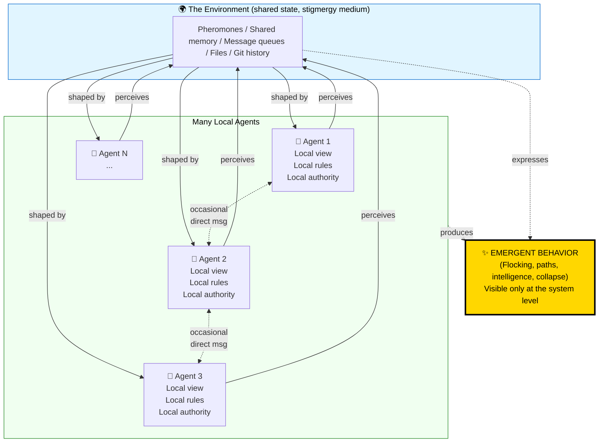
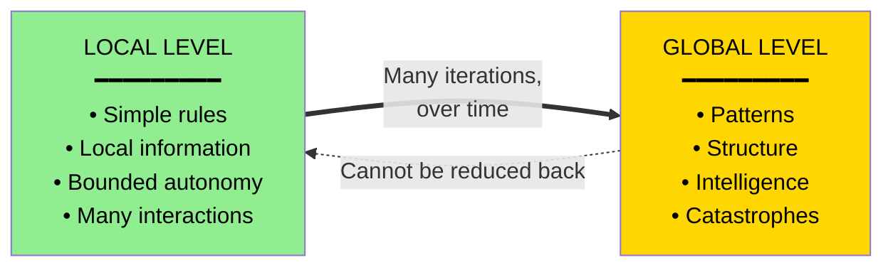

# Emergence, Complexity & Multiagent Systems
### A Teaching Guide That Should Make Light Bulbs Pop

> *"More is different."* — Philip Anderson, 1972
>
> One ant is stupid. A colony is intelligent. The ant didn't get smarter. **Something else happened.**

---

## Part 1: The Big Aha — What Even Is Emergence?

### The Story That Started It All

Imagine you've never seen water. I hand you two hydrogen atoms and one oxygen atom and ask: *"What does this stuff do?"*

You study hydrogen. It's a flammable gas. You study oxygen. It's another gas that makes things burn. You combine them.

You get a liquid. That **puts out fire**.

Nothing in hydrogen "contains" liquidity. Nothing in oxygen "contains" wetness. Yet when they interact, wetness *appears* — not as a property of the parts, but as a property of the relationship.

**This is emergence.** A pattern at a higher level that isn't present at the lower level, but arises *because of* how the lower level interacts.

> 💡 **The first light bulb:** Emergence isn't magic. It isn't mystical. It's what happens when interactions matter more than the things doing the interacting.

### The Termite Cathedral

In Namibia, termites — each one essentially a tiny biological machine with about 500,000 neurons — build cathedrals. Climate-controlled, air-conditioned, ten-foot-tall fungus farms with passive ventilation systems that human architects literally copy.

**No termite knows what a cathedral is.**

There is no blueprint. No foreman. No CEO termite. Each termite follows a handful of dumb rules: *"If I smell pheromone X, drop a dirt pellet here. If I smell pheromone Y, dig there."* That's basically it.

The cathedral is not designed. It is **grown** out of millions of tiny local decisions that none of the participants understand.

> 💡 **The second light bulb:** Intelligence at the system level does not require intelligence at the agent level. It requires the *right kind of local rules* and enough interactions.

---

## Part 2: Complexity Theory — The Field That Studies This

### Complicated vs. Complex (The Distinction Everyone Misses)

This is the single most important distinction in the field, and most people use the words interchangeably. Don't.

| | **Complicated** | **Complex** |
|---|---|---|
| Example | A Boeing 747 | A flock of starlings |
| Predictable? | Yes — same inputs, same outputs | No — sensitive to initial conditions |
| Decomposable? | Yes — fix one part at a time | No — parts only make sense in context |
| Designed? | Top-down | Bottom-up (or no one) |
| Failure mode | A part breaks | The whole pattern collapses |

A jet engine has 25,000 parts. It's *complicated*. But if you understand each part, you understand the engine. A starling murmuration has maybe 5,000 birds. It's *complex*. Understanding one bird tells you almost nothing about why the flock moves like liquid silver across the sky.

> 💡 **The third light bulb:** Most software engineering trains you for the complicated. Multiagent systems live in the complex. **Your debugger does not work here.**

### The Four Vital Signs of a Complex Adaptive System

When you see these four together, you're looking at a complex adaptive system (CAS):

1. **Many agents** — not one, not two, *many*. Interactions matter more than individuals.
2. **Local interactions** — agents only see and affect their neighbors, never the whole.
3. **Adaptation** — agents change behavior based on what they experience.
4. **No central controller** — there's no one in charge. (And yet things work.)

Examples: ant colonies, immune systems, the stock market, cities, the brain, language, Wikipedia, the internet, ecosystems, your microbiome.

### The Phase Transition Aha

Heat water. At 99°C it's hot water. At 100°C it's *steam*. A 1° change produced a categorical change — a phase transition. The system reorganized itself.

Complex systems do this. Add one more car to a highway and traffic suddenly jams. Add one more node to a network and information cascades become possible. Add one more agent to a market and a bubble forms.

> 💡 **The fourth light bulb:** Complex systems don't change gradually. They sit on edges and tip. The skill isn't predicting the change — it's recognizing you're near an edge.

---

## Part 3: Multiagent Systems — Engineering Emergence on Purpose

A **multiagent system (MAS)** is what happens when we deliberately build software with multiple autonomous agents and let useful behavior emerge from their interactions. This is no longer just a theoretical lens — it's how modern AI systems, distributed systems, and even your microservices architecture actually work.

### What Is an Agent, Really?

Strip away the jargon. An agent is anything that:

- **Perceives** its environment (reads inputs)
- **Decides** based on what it perceives (has a policy)
- **Acts** on the environment (produces outputs)
- **Has goals** (some notion of what "good" looks like)
- Has some **autonomy** (chooses its own actions, not commanded step-by-step)

A thermostat is a (very simple) agent. So is a trading bot. So is a Claude Code instance. So is a termite.

### Localized Authority & Autonomy — The Core Design Principle

This is where most engineers, trained on hierarchical systems, get stuck. Let me tell a story.

**The Toyota Andon Cord Story.** On a Toyota assembly line, any worker — *any* worker, including the newest hire on their first day — can pull a cord that stops the entire factory if they see a defect. No permission needed. No manager approval. They have **localized authority** over their station, and the system trusts that local decision.

Compare this to a traditional factory where a worker spots a defect, tells their supervisor, who tells the floor manager, who escalates to the plant manager, who decides whether to stop the line — by which time 200 defective cars have been built.

Localized authority means: **the agent who has the information also has the power to act on it.**

In multiagent design, this translates to:

- Agents don't ask permission for every action
- Agents don't wait for a central coordinator
- Agents act on local information using their local policy
- The system trusts that good local decisions, in aggregate, produce good global behavior

> 💡 **The fifth light bulb:** Centralization isn't safer. It's often catastrophically more fragile. The Toyota line catches defects that the GM line built into cars and shipped to customers.

#### Why Localized Authority Produces Emergent Intelligence

Think about your immune system. There's no "command center" deciding which pathogens to attack. Billions of cells make local decisions — "this thing in front of me looks foreign, attack" — and out of those billions of local decisions emerges a defense system smarter than anything we know how to design top-down.

If your immune system had to escalate every decision to a central authority, you'd be dead before lunch.

**The principle:** Push authority to where the information lives. Trust local agents. Design good local rules. Let global intelligence emerge.

### Communication & Coordination — How Agents Talk Without a Boss

If there's no central controller, how do agents coordinate? Three main mechanisms, each worth feeling deeply:

#### 1. Direct messaging (explicit)

Agents send messages to each other. Like microservices calling APIs. Clean, but tight coupling — each agent has to know who to talk to.

#### 2. Stigmergy (environmental signals)

This word is gold. It means *"coordination through the environment."* Ants don't email each other. An ant lays down pheromone. Another ant, much later, smells it and reacts. They never meet. They never know about each other. **The environment is the communication medium.**

Software example: Kubernetes pods don't message each other to coordinate scaling. They write metrics to a shared environment (etcd, Prometheus), and other agents (the scheduler, the autoscaler) read those metrics and react. **The shared state is the conversation.**

> 💡 **The sixth light bulb:** When you put a `TODO` comment in code for a future agent (human or AI) to pick up, you're using stigmergy. Git is stigmergy. Your codebase IS the environment through which a distributed team of agents coordinates across time.

#### 3. Norms and protocols (implicit)

Cars don't message each other at intersections. They follow a shared protocol (traffic laws). The protocol *is* the coordination.

### The Spectrum of Coordination

```
Fully centralized ──────────────────────────────── Fully decentralized
   Master/slave        Hierarchical        P2P / Swarm
   (Conductor)         (Manager + team)    (No one in charge)

   Predictable         Balanced            Resilient
   Brittle             Bureaucratic        Hard to debug
```

The choice isn't binary. Real systems blend. Your team has a manager (some hierarchy) but you also have peer review (some decentralization). Good multiagent design picks the right blend for the problem.

---

## Part 4: Emergent Behaviors — The Patterns That Show Up

Here's the catalog. Recognize these in the wild — they're everywhere once you have eyes for them.

### Flocking & Swarming

Craig Reynolds, 1986, gave us *boids* — fake birds following three rules:

1. **Separation:** Don't crash into your neighbor
2. **Alignment:** Match the average heading of nearby flockmates
3. **Cohesion:** Steer toward the average position of nearby flockmates

That's it. Three rules. Out comes flocking — indistinguishable from real birds. No leader, no plan, no understanding of "flock."

**Real-world echo:** This is exactly how drone swarms now fly in coordinated light shows. The same three rules.

### Self-Organization

Pour iron filings around a magnet — they form lines. No one told them to. The energy gradient (magnetic field) plus simple local rules (each filing aligns with the field) produces structure.

In multiagent systems: load balancers don't need to "decide" how to distribute traffic. Given the right local rules (each request goes to the least-loaded server it knows about), distribution emerges.

### Stigmergy in Action — The Ant Path

Place food at point B and an ant colony at point A. Initially, ants wander randomly. The ones who happen to find food return home, laying pheromone. Other ants prefer pheromone-marked paths and reinforce them. Shorter paths get reinforced faster (round trips are quicker), so pheromone concentrates on the shortest route.

**Within hours, the colony has discovered the shortest path between two points** — solved a problem that's NP-hard in general (Traveling Salesman) — using ants with the cognitive power of a calculator.

This algorithm, *Ant Colony Optimization*, now routes packets through internet networks.

### Cascades & Avalanches

Drop one grain of sand on a sandpile. Most of the time, nothing happens. Sometimes, one grain triggers an avalanche of thousands. The grain isn't special. The *state of the pile* is.

**Real-world echoes:** Bank runs. Twitter virality. The 2010 Flash Crash. Power grid blackouts. None of these were caused by a "big" event. They were small triggers in pre-loaded systems.

### Feedback Loops

- **Positive (amplifying):** A trend feeds itself. Viral content, market bubbles, runaway training loops.
- **Negative (stabilizing):** A deviation gets corrected. Thermostats, ecosystems in balance, well-designed circuit breakers.

Healthy complex systems have both. Pure positive feedback explodes. Pure negative feedback stagnates.

### Tipping Points & Critical Mass

A behavior remains rare until it crosses a threshold — then it sweeps the population. Languages dying, technology adoption, the collapse of a regime, a meme going viral. The mathematics is often the same (logistic curves, percolation thresholds).

### Power Laws (The Fingerprint of Emergence)

If you see a *power law distribution* (most events tiny, a few catastrophic — earthquakes, city sizes, word frequencies, file sizes on the web, wealth), you're almost certainly looking at a complex system.

Normal distributions come from independent events. Power laws come from *interacting* events. The fingerprint of complexity is literally visible in the histogram.

---

## Part 5: The Mental Model — Visualize It



**The key insight in this diagram:** The emergent behavior at the top isn't computed anywhere. No agent calculates it. No environment stores it. **It only exists as a pattern observable from outside the system.**



The dotted arrow is the heartbreak of complexity science: you can go *up* but not *down*. You can't decompose the global pattern into local causes. **The pattern is real, but it lives at a level no agent inhabits.**

---

## Part 6: Example Problems for Teaching

These are sequenced from gentle to mind-bending. Each one is designed to produce a specific aha.

### Problem 1: The Game of Life (The Gateway Drug)

**Setup:** A grid. Each cell is alive or dead. Each tick, a cell follows these rules based on its 8 neighbors:

- Live cell with 2 or 3 live neighbors → stays alive
- Live cell with fewer than 2 → dies (loneliness)
- Live cell with more than 3 → dies (overcrowding)
- Dead cell with exactly 3 live neighbors → becomes alive

**The exercise:** Have students predict what patterns will emerge. Then run it.

**The aha:** From these four rules emerge *gliders that move across the screen, oscillators that pulse, "guns" that shoot out gliders, and — astonishingly — patterns that compute. The Game of Life is Turing-complete.* Four rules. No design. Universal computation emerges.

**Teaching note:** Make them sit with the fact that no rule mentions movement, yet things move. Movement *emerges* from a static rule set.

### Problem 2: Schelling's Segregation Model (The Uncomfortable Aha)

**Setup:** A grid of two colors of agents. Each agent has a simple preference: *"I'm happy if at least 30% of my neighbors are the same color as me."* Note: agents are not racist — they're fine being in a 70% minority. If unhappy, they move to a random empty spot.

**The exercise:** Run the simulation.

**The aha:** Even with this *extremely* tolerant rule, the grid rapidly self-organizes into completely segregated neighborhoods. **Mild individual preferences produce extreme collective outcomes.**

**Teaching gold:** This is the moment students realize you cannot infer individual intent from collective outcome. Segregated neighborhoods don't require racist individuals. Massive surveillance doesn't require malicious engineers. **Systems have ethics that individuals don't have.**

### Problem 3: The Boids Flocking Simulator (Build It)

**The build:** Have students implement Reynolds' three rules (separation, alignment, cohesion) in code — about 30 lines. Run with 100 boids.

**The aha:** Their toy code produces visually convincing flocking. Add a "predator" boid with a fourth rule (flee anything bigger). Watch the flock split, swirl, regroup. They wrote *zero* code for "split when threatened" — yet it happens.

**Extension question:** "What's the smallest change to the rules that would break flocking entirely?" (Surprising answer: tiny weight changes can produce wildly different macro behavior. This is sensitivity to parameters — a hallmark of complex systems.)

### Problem 4: The Tragedy of the Commons (The Coordination Failure)

**Setup:** N agents share a pasture (or a fishery, or an API rate limit, or an open-source maintainer's attention). Each agent benefits from using more of the resource, but the resource regenerates only so fast. If total usage exceeds regeneration, the resource collapses.

**The exercise:** Each student is an agent. They privately choose how much to extract each round. Watch what happens.

**The aha:** Even when everyone *knows* the math, the system collapses. Individually rational decisions produce collectively suicidal outcomes. **Local rationality is not the same as global rationality.**

**Discussion bridge:** What mechanisms can fix this? (Property rights, regulation, reputation, repeated games, the work of Elinor Ostrom on commons governance — she won the Nobel for showing how communities solve this without top-down control.)

### Problem 5: The Bucket Brigade (Designing Local Rules)

**The challenge:** Design a multiagent system that moves water from a well to a fire 100m away, using N agents, with no central coordinator and only local information (each agent only sees their immediate neighbors).

**Constraints:** Agents can't see the well, the fire, or the overall pipeline. They can only see who's near them and whether they're holding water.

**The aha:** Watch students discover that they need to design *rules*, not *plans*. The solution looks like: *"If my left neighbor offers me water, take it. If my right neighbor is empty-handed and I have water, hand it over."* This local rule, replicated across all agents, produces a working bucket brigade.

This is exactly how packet routing on the internet works.

### Problem 6: The AI Agent Swarm (Modern & Relevant)

**The scenario:** Design a system where multiple AI agents collaborate to refactor a large codebase. Constraints:

- No agent can hold the entire codebase in context
- Agents must coordinate without a central orchestrator becoming a bottleneck
- The system must be resilient to individual agent failures
- Different agents may have different specialties (testing, refactoring, documentation)

**The teaching arc:** Walk students through:

1. **Communication design:** Will agents message directly? Use a shared scratchpad (stigmergy)? Both?
2. **Authority design:** Can any agent commit code, or only some? Who decides conflicts?
3. **Emergence to expect:** What useful behaviors might emerge? (Specialization, work-stealing, quality stratification.) What harmful behaviors? (Thrashing, redundant work, drift.)
4. **Observability:** How do you debug a system whose intelligence lives at a level no single agent inhabits?

**The aha:** They realize this isn't science fiction. This is roughly how Devin, Claude Code with sub-agents, and modern agentic systems already work. **The theory they just learned is the engineering they're about to do.**

### Problem 7: The Phase Transition Hunt (Advanced)

**The challenge:** Take any simple multiagent simulation (boids, Schelling, etc.) and find the parameter sweep where the system suddenly changes behavior. Plot the macroscopic measure (cluster size, flock coherence, etc.) against the parameter.

**The aha:** Students see *with their own eyes* that the curve isn't smooth. There's a region where things change abruptly. They're seeing a phase transition. This is the same mathematics as water freezing, magnets demagnetizing, traffic jamming, and pandemics taking off.

---

## Part 7: The Cross-Domain Lens (For Connecting the Dots)

This is what makes complexity theory beautiful — and worth teaching. The same patterns recur across wildly different domains. Once you have the eyes, you see them everywhere.

| Domain | The Agents | The Environment | What Emerges |
|---|---|---|---|
| Ant colony | Ants | Soil, pheromones | Foraging, nest building |
| Brain | Neurons | Chemical/electrical | Thought, consciousness(?) |
| Market | Traders | Prices, order books | Equilibria, crashes, bubbles |
| City | Residents | Streets, zoning | Neighborhoods, gentrification |
| Internet | Routers, hosts | Network topology | Information cascades |
| Wikipedia | Editors | Articles, edit history | A living encyclopedia |
| Microservices | Services | Network, queues | System behavior, outages |
| AI agent swarm | LLM agents | Shared memory, tools | Collaborative problem-solving |
| Language | Speakers | Conversations | Grammar drift, slang |
| Immune system | Immune cells | Body | Defense, autoimmunity |
| Open source | Contributors | Repos, issues | Software, communities |

> 💡 **The grand light bulb:** Once you internalize this, you stop seeing a software bug, a market crash, a riot, and a pandemic as unrelated events. They're all instances of a **complex adaptive system tipping into a new regime.** Same math. Same dynamics. Different agents.

---

## Part 8: Why This Matters Right Now

You're not learning ancient theory. You're learning the operating manual for the world you're now building.

- **Modern AI systems are multiagent systems.** When Claude Code spawns sub-agents, when Devin coordinates with itself across sessions, when retrieval agents talk to coding agents talk to testing agents — you're engineering emergence. The theory above isn't abstract; it's the spec.

- **Modern software systems are multiagent.** Microservices, event-driven architectures, Kubernetes — all of these are coordination problems between autonomous agents. Failure modes you'd never anticipate in a monolith (cascading retries, thundering herds, split-brain) are the textbook failure modes of complex systems.

- **Modern teams are multiagent.** Especially distributed, async, human-AI hybrid teams. The reason async-with-good-docs (stigmergy through the codebase) often beats synchronous-meeting-heavy work is not a preference — it's a property of how complex systems coordinate.

- **The future is more of this, not less.** As we delegate more autonomy to more agents (AI or otherwise), the people who can think in terms of local rules, emergent properties, and phase transitions will design systems that work. The people who think only in terms of top-down control will keep building things that fail in surprising ways.

---

## Part 9: A Final Story (The One to End the Class With)

In the 1980s, a researcher named Tom Seeley studied honeybees. When a colony outgrows its hive, it needs to find a new home. Scouts fly out, explore candidate sites, return, and dance.

The dance encodes the *quality* of the site they found. Better sites get more enthusiastic dances. Other bees observing the dances are recruited to go check out promoted sites — and if they agree, they come back and dance for that site too.

Eventually, when enough bees are dancing for one site (a quorum), the whole swarm takes off and moves there.

Here's what's stunning. **Seeley's research showed that the colony's collective choice was, on average, a better choice than the best individual scout's recommendation.** The colony is smarter than any bee in it.

There's no queen directing this. The queen isn't involved. The colony, as a system, *deliberates* — through dance, through positive feedback for good options, through negative feedback (the dances decay if not reinforced), through a quorum threshold — and decides.

This is what we mean by emergent intelligence. Not metaphorical intelligence. **Actual, measurable, decision-making intelligence at a level higher than any agent.**

And now, in 2026, when we build swarms of AI agents that deliberate, vote, critique each other's work, and converge on decisions — we are not inventing something new. **We are re-discovering, in silicon, what evolution discovered in beehives sixty million years ago.**

The light bulb to leave students with: *You are not just learning a theory. You are joining a 60-million-year-old conversation about how minds can be built out of many small things that don't know what they're doing.*

---

## Suggested Further Reading

- *Complexity: A Guided Tour* — Melanie Mitchell (the best single book on this)
- *Emergence* — Steven Johnson (most accessible)
- *Reinventing the Sacred* — Stuart Kauffman (deepest, philosophically)
- *Multiagent Systems* — Yoav Shoham & Kevin Leyton-Brown (rigorous textbook)
- *Honeybee Democracy* — Tom Seeley (the bee story above, expanded)
- *Governing the Commons* — Elinor Ostrom (how communities solve coordination)

---

*"The whole is more than the sum of its parts" is not a poetic statement. It is a precise scientific claim. The parts add up to one thing. The whole, when those parts interact, is something else.*
