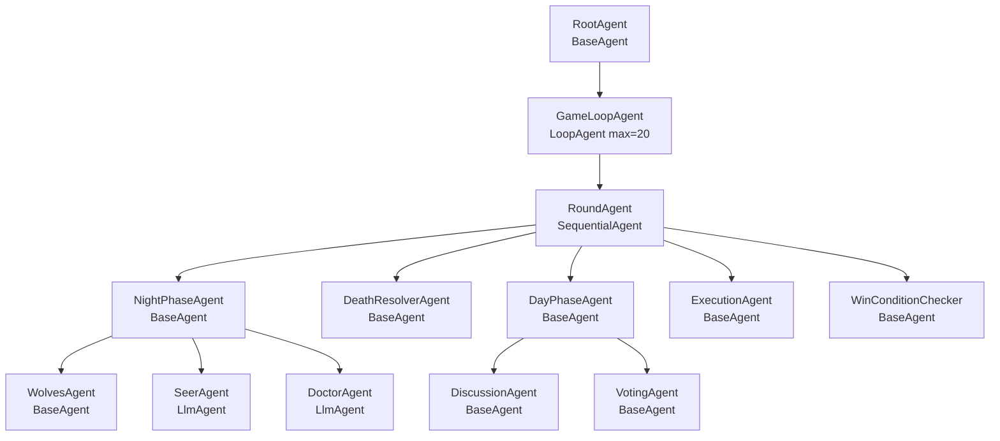
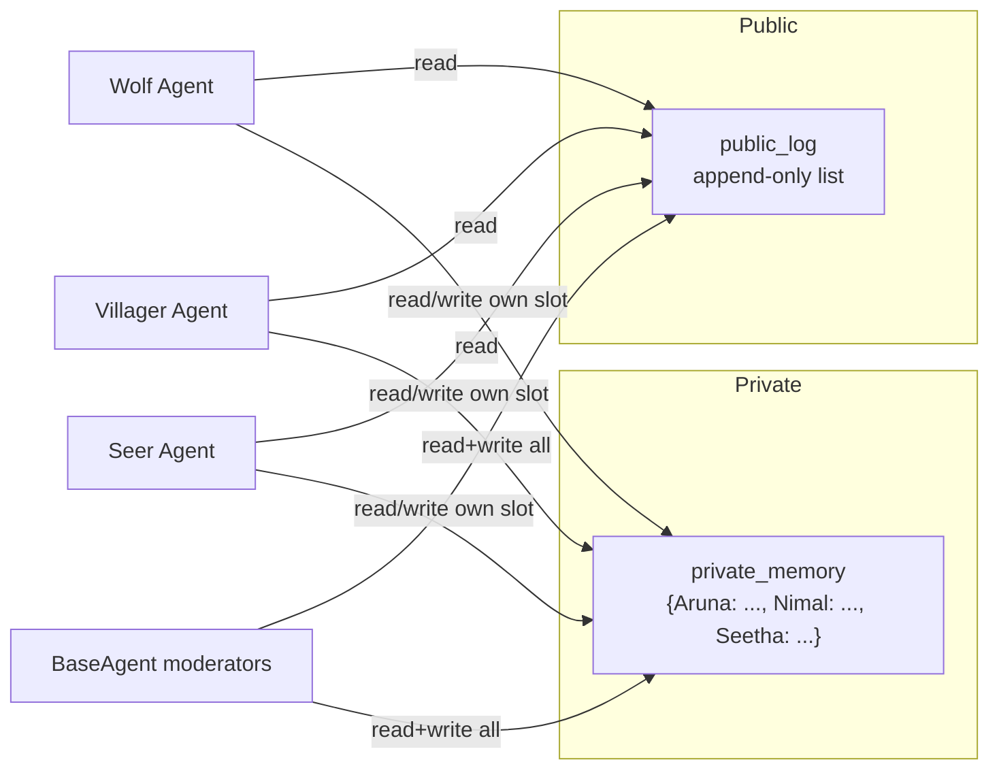
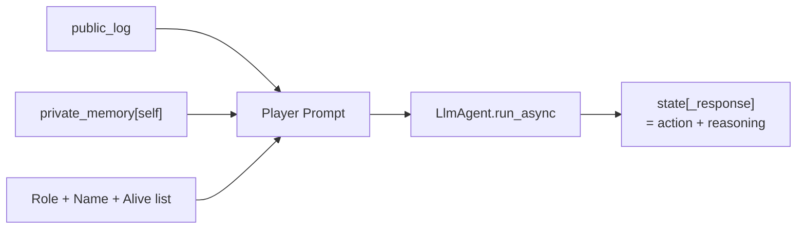
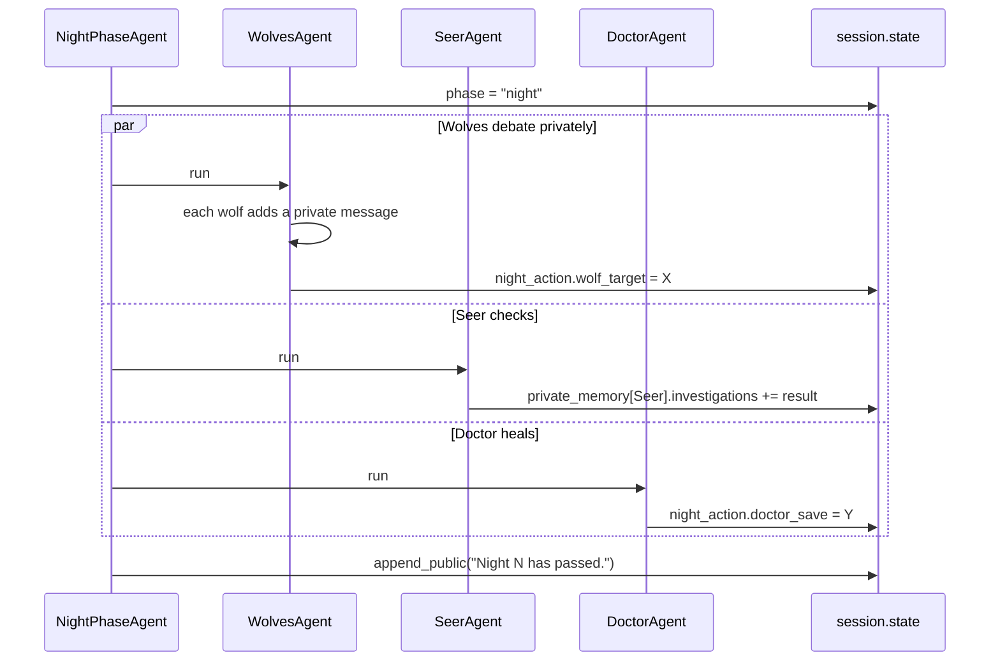
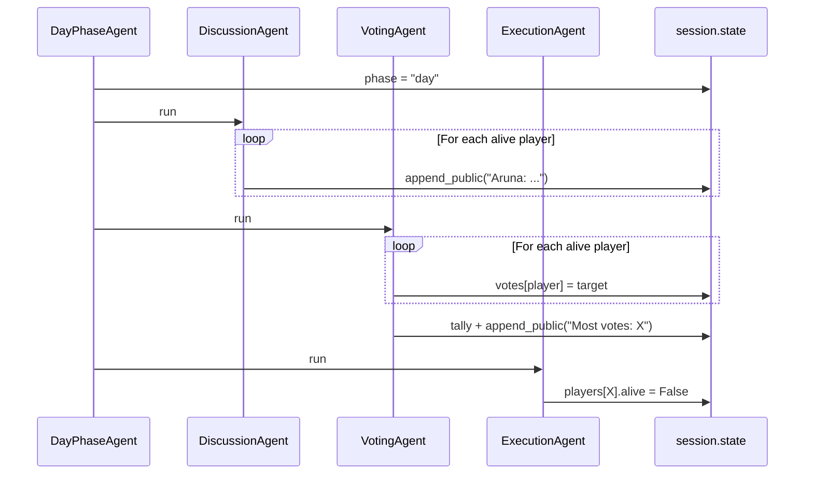
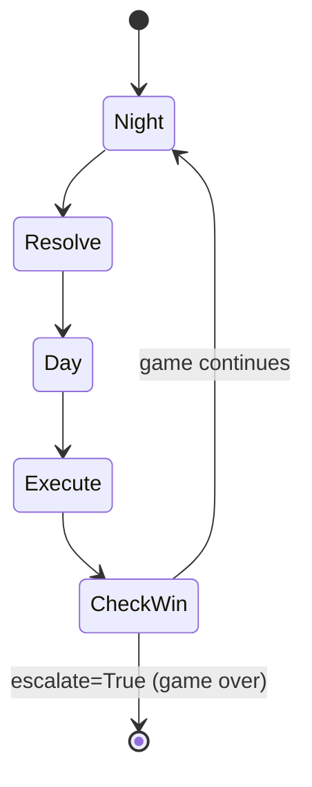
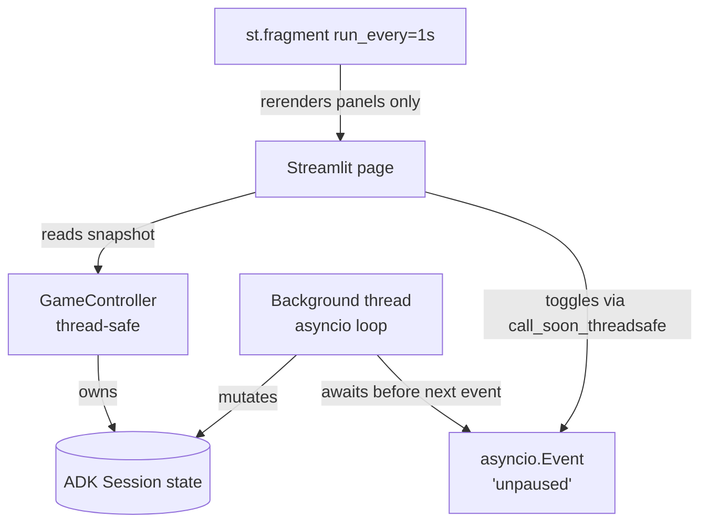

# Mafia Village — Building a Multi-Agent Simulation with Google ADK

## What you'll build

By the end of this session, we'll have a small Streamlit app that simulates the classic social-deduction game **Mafia** (also known as Werewolf). The "players" aren't humans — they're LLM-powered agents built with **Google's Agent Development Kit (ADK)**. They lie to each other, vote for each other, and occasionally save each other's lives.

Picture it: a left panel titled **Village Square** that shows public dialogue scrolling in as agents accuse each other ("I don't trust Aruna, she was too quiet last round"). A right panel titled **Moderator Log** tracks system events ("Night 2 begins", "Nimal was eliminated"). Down the side, a list of players each with a green dot (alive) or a grey skull (dead). At the top, a big **Pause** button and a **Peek** dropdown — pause the game between phases and inspect any agent's secret role, their private memory, and the exact reasoning that drove their last vote. That last part is the pedagogical money shot: you'll *see* a wolf decide to frame an innocent villager, then watch the village fall for it.

Here's the agent tree we're going to build:



## What you'll learn

- How to compose **LlmAgent**, **SequentialAgent**, **LoopAgent**, and custom **BaseAgent** subclasses into a working multi-agent system.
- How agents share information through **session state** — the "shared whiteboard" pattern.
- How to design **public vs private** information channels so some agents can keep secrets.
- How to escape a `LoopAgent` cleanly using `EventActions(escalate=True)`.
- How to run an ADK agent tree from a **Streamlit** UI while keeping the UI responsive.
- How to build **pause/peek/resume** controls using `asyncio.Event` and Streamlit session state.
- How to think about **emergent behavior** — when agents do clever things you never explicitly programmed.

## Prerequisites

- **Python 3.10 or newer**. Check with `python --version`.
- A **Google AI Studio API key**. Get one free at [https://aistudio.google.com/apikey](https://aistudio.google.com/apikey).
- **90–120 minutes** of uninterrupted focus.
- Comfort reading async Python helps, but we'll explain the async bits as we go.

---

## Part 0 — The Big Picture

### Why multi-agent?

You could write Mafia as one giant LLM prompt: *"You are running a Mafia game with 7 players named X, Y, Z. Roleplay all of them and decide who dies."* It would technically work — and it would also be a mess. The LLM would forget who's dead, lose track of whose turn it is, leak the wolves' identities to the villagers, and there'd be no way to debug *why* it made any decision.

Think of a hospital. One person can't be the surgeon, the anaesthetist, the nurse, the receptionist, and the patient at the same time. Each role has its own knowledge, its own job, its own constraints. The hospital works because they coordinate through **shared records** (the patient's chart) and **private knowledge** (the surgeon's training).

Multi-agent systems work the same way. Each agent has a **single, narrow job**, its **own context** (instructions and private memory), and access to a **shared whiteboard** (session state).

### The four ADK primitives we'll use

| Primitive | What it does | When we use it |
|---|---|---|
| `LlmAgent` | A single LLM call with an instruction and an `output_key` that writes the response into state. | Every player, the Seer, the Doctor. |
| `SequentialAgent` | Runs sub-agents one after another. | The `RoundAgent` (night → resolve → day → execute → check). |
| `LoopAgent` | Re-runs its sub-agent until `max_iterations` is hit or a child yields `EventActions(escalate=True)`. | The game loop. |
| `BaseAgent` (custom) | Pure Python orchestration — branching, gathering, state mutations, "no-LLM" logic. | Wolves' private chat, death resolution, vote tallying, win checking. |

> 💡 **Notice this:** ADK isn't asking you to choose between "code" and "LLM" — it lets you mix them. The wolves *talk* with an LLM, but the rule "if doctor saved the target, no one dies tonight" is plain Python in a `BaseAgent`. Use the right tool for each job.

---

## Part 1 — Project setup

### Step 1.1 — Folder structure

```
mafia-village/
├── .env
├── requirements.txt
├── app.py                  # Streamlit UI
├── smoke_test.py           # quick sanity check
└── mafia/
    ├── __init__.py
    ├── names.py            # Sri Lankan name pool
    ├── state.py            # state schema + helpers
    ├── players.py          # player agent factory + role prompts
    ├── night.py            # Wolves, Seer, Doctor, NightPhase, DeathResolver
    ├── day.py              # Discussion, Voting, DayPhase, Execution
    ├── game.py             # WinConditionChecker + build_game()
    └── control.py          # pause/peek primitives
```

```bash
mkdir -p mafia-village/mafia
cd mafia-village
touch mafia/__init__.py
```

### Step 1.2 — Virtual environment

```bash
# macOS / Linux
python -m venv .venv
source .venv/bin/activate

# Windows (PowerShell)
python -m venv .venv
.venv\Scripts\Activate.ps1
```

You should see `(.venv)` in front of your prompt.

### Step 1.3 — Install dependencies

```bash
pip install google-adk python-dotenv streamlit rich
```

> ⚠️ **Common pitfall:** If `pip install google-adk` fails with "no matching distribution," your Python is older than 3.10. Run `python --version`.

### Step 1.4 — Get an API key

1. Open [https://aistudio.google.com/apikey](https://aistudio.google.com/apikey), sign in, click **Create API key**, copy it.
2. Create `mafia-village/.env`:

```bash
# mafia-village/.env
GOOGLE_API_KEY=paste-your-key-here
```

> ⚠️ **Common pitfall:** Add `.env` to `.gitignore` right now, while you're thinking about it.

### Step 1.5 — Pin dependencies

```text
# mafia-village/requirements.txt
google-adk>=0.4.0
python-dotenv>=1.0.0
streamlit>=1.36.0
rich>=13.7.0
```

### Step 1.6 — Smoke test

One agent. One prompt. One reply.

```python
# mafia-village/smoke_test.py
"""A 30-second sanity check: can we talk to Gemini through ADK?"""
import asyncio
from dotenv import load_dotenv
from google.adk.agents import LlmAgent
from google.adk.sessions import InMemorySessionService
from google.adk.runners import Runner
from google.genai import types

load_dotenv()

hello_agent = LlmAgent(
    name="HelloAgent",
    model="gemini-flash-latest",
    instruction="You are a friendly greeter. Reply in one sentence.",
)


async def main() -> None:
    session_service = InMemorySessionService()
    await session_service.create_session(
        app_name="smoke", user_id="u1", session_id="s1", state={}
    )
    runner = Runner(
        agent=hello_agent, app_name="smoke", session_service=session_service
    )
    message = types.Content(role="user", parts=[types.Part(text="Say hi to my class.")])
    async for event in runner.run_async(
        user_id="u1", session_id="s1", new_message=message
    ):
        if event.content and event.content.parts:
            for part in event.content.parts:
                if part.text:
                    print(f"[{event.author}] {part.text}")


if __name__ == "__main__":
    asyncio.run(main())
```

```bash
python smoke_test.py
```

**What you should see:** one line, e.g. `[HelloAgent] Hi class — excited to learn with you today!`

> 💡 **Notice this:** No HTTP client, no manual prompt template, no JSON parsing. ADK abstracts the call. From here on, our job is **composing** agents.

---

## Part 2 — Designing the State (the shared whiteboard)

Before any code: **what does every agent need to know, and what should each one keep secret?**

Imagine a poker game. The **river** is public — every player sees the same cards and reasons about them. Your **hand** is private — only you see it, and the whole game hinges on that asymmetry. Mafia is identical: wolves know each other, the seer knows her investigations, villagers only know what's been said aloud. Remove that asymmetry and the game collapses into nonsense.

We'll model it with **one shared dictionary** that has a public side and a private side:

- `state["public_log"]` — an append-only list every agent reads.
- `state["private_memory"][player_name]` — a dict per player, only fed into *that* player's prompt.



> 💡 **Notice this:** Privacy in this system is enforced by **what we choose to put in each agent's prompt**, not by any ADK firewall. The Python code (a `BaseAgent`) can read every slot — it has to, in order to deliver each player their own. The moment we hand a string to the LLM, *that string* is the player's entire world.

### Build the state module

We'll keep the helpers tiny so later code reads like prose, not dictionary plumbing.

```python
# mafia-village/mafia/state.py
"""Schema + tiny helpers for the shared whiteboard.

The runner stores everything under `session.state`. Custom agents read
and mutate this dict in place; LlmAgents only ever see the slice we
manually compose into their prompts.
"""
from __future__ import annotations
from typing import Any, Literal, TypedDict

Role = Literal["villager", "wolf", "seer", "doctor"]


class PlayerInfo(TypedDict):
    name: str
    role: Role
    alive: bool


def init_state(players: list[PlayerInfo]) -> dict[str, Any]:
    """Build the initial state dict the runner will start with."""
    return {
        "players": players,
        "public_log": [],
        "private_memory": {p["name"]: {} for p in players},
        "day_number": 0,
        "phase": "setup",
        "night_action": {"wolf_target": None, "doctor_save": None, "seer_check": None},
        "votes": {},
        "winner": None,
        "events": [],   # moderator log — for the UI only, never fed to any agent
    }


def append_public(state: dict[str, Any], line: str) -> None:
    """Anything in public_log will appear in every agent's prompt."""
    state["public_log"].append(line)


def log_event(state: dict[str, Any], line: str) -> None:
    """The moderator log is for humans; agents never read it."""
    state["events"].append(line)


def write_private(state: dict[str, Any], player: str, key: str, value: Any) -> None:
    """Set one slot in one player's private memory."""
    state["private_memory"].setdefault(player, {})[key] = value


def read_private(state: dict[str, Any], player: str) -> dict[str, Any]:
    """Read one player's private memory — used when composing their prompt."""
    return state["private_memory"].get(player, {})


def alive_players(state: dict[str, Any]) -> list[PlayerInfo]:
    return [p for p in state["players"] if p["alive"]]


def players_with_role(state: dict[str, Any], role: Role) -> list[PlayerInfo]:
    return [p for p in state["players"] if p["role"] == role and p["alive"]]
```

> ⚠️ **Common pitfall:** Inside a custom `BaseAgent`, **mutate state in place** — `state["public_log"].append(...)`. If you reassign the whole list (`state["public_log"] = [...]`), other code that's still holding the old list reference won't see your change. The helpers above always mutate; copy that pattern in your own code.

### Try it — feel the asymmetry

The whole tutorial rests on this one idea. Let's make sure we *feel* it before moving on. We'll fake one night of events and then look at the state through three different players' eyes.

```python
# mafia-village/smoke_state.py
"""Simulate one round's-worth of state mutations, then peek at it from
three different players' points of view. Notice how much each one can see."""
from mafia.state import (
    init_state, append_public, log_event,
    write_private, read_private,
)

players = [
    {"name": "Aruna",   "role": "wolf",     "alive": True},
    {"name": "Nimal",   "role": "wolf",     "alive": True},
    {"name": "Seetha",  "role": "seer",     "alive": True},
    {"name": "Kamala",  "role": "doctor",   "alive": True},
    {"name": "Bandara", "role": "villager", "alive": True},
]
state = init_state(players)

# A fake night happens behind the scenes:
append_public(state, "Day 1 begins. The village wakes up.")
log_event(state, "Night 1 — wolves chose Bandara; doctor saved nobody.")
write_private(state, "Aruna",  "wolf_chat",      ["Aruna: Bandara is loud, kill him."])
write_private(state, "Nimal",  "wolf_chat",      ["Aruna: Bandara is loud, kill him."])
write_private(state, "Seetha", "investigations", [{"target": "Aruna", "result": "wolf"}])


def what_does(player_name: str) -> dict:
    """Return ONLY what `player_name` is allowed to see.
    This is exactly the slice we'll feed into each LLM prompt later."""
    return {
        "public": state["public_log"],
        "my_private": read_private(state, player_name),
    }


for name in ["Bandara", "Seetha", "Aruna"]:
    print(f"\n=== What {name} sees ===")
    print(what_does(name))
```

Run it:

```bash
python smoke_state.py
```

Read the three blocks carefully:

- **Bandara** (an innocent villager) sees only the dawn line. He has no idea anyone has decided he should die tonight.
- **Seetha** sees the dawn line **and** her secret investigation — Aruna is a wolf. She is the only player with that information.
- **Aruna** sees the dawn line **and** her private chat with Nimal. The villagers will never see this string.

> 💡 **Notice this:** The same dictionary holds everyone's secrets, but each player gets a different *slice* of it through one tiny function — `what_does(player_name)`. In Part 3 we'll do the same thing to build each agent's prompt. The whole rest of the system is a more elaborate version of this one helper.

> 💡 **Notice this:** `what_does("Bandara")` doesn't check Bandara's role, doesn't filter the wolves out, doesn't do any cryptography. The privacy comes purely from **what we chose to include**. Internalise this idea now and the rest of the tutorial will feel obvious.

---

## Part 3 — Creating a Player Agent

Every player is just an `LlmAgent` with a role-specific instruction. What changes between roles is **what they see** and **what they're trying to do**.



> 💡 **Notice this:** We don't make a separate `WolfClass` or `SeerClass`. We make one factory that feeds *different prompts* to one `LlmAgent`. The agent's identity lives in language, not in class hierarchies. This is a very different style from object-oriented thinking — get used to it; it's where multi-agent systems get their flexibility.

### Sri Lankan name pool

```python
# mafia-village/mafia/names.py
"""Default player names — a small pool of Sri Lankan first names."""
DEFAULT_NAMES: list[str] = [
    "Aruna", "Nimal", "Seetha", "Kamala", "Bandara",
    "Chathura", "Dilani", "Eshan", "Fathima", "Gayan",
    "Hashini", "Ishara", "Janaki", "Kavindu", "Lakmali",
]
```

### Role prompt templates

```python
# mafia-village/mafia/players.py
"""Player agent factory + role-specific instruction templates."""
from __future__ import annotations
from google.adk.agents import LlmAgent

VILLAGER_INSTRUCTION = """\
You are {name}, a Villager in a Mafia game. You do NOT know who the wolves are.

You will be given:
- The full public chat log (everyone sees this).
- Your own private notes from previous rounds.
- A specific task (SPEAK, VOTE, etc.).

Goals:
- Help the village identify the wolves through discussion and voting.
- Be sceptical but not paranoid.
- Quote specific things people said when you accuse them.

When asked to SPEAK: reply with 1-3 sentences of in-character dialogue.
When asked to VOTE: reply on TWO lines exactly:
VOTE: <player_name>
REASON: <one short sentence>
"""

WOLF_INSTRUCTION = """\
You are {name}, a WOLF in a Mafia game. Your teammates are: {teammates}.

You will be given:
- The full public chat log.
- Your own private notes including your wolf-chat with teammates.
- A specific task.

Goals:
- Eliminate villagers at night, alongside your teammates.
- During the day, blend in. Pretend to be a villager. Cast doubt on real
  villagers. NEVER reveal you are a wolf.
- When voting, never vote for a teammate unless they're already doomed.

When asked to SPEAK: reply with 1-3 sentences that sound like a worried villager.
When asked to VOTE: reply on TWO lines:
VOTE: <player_name>
REASON: <one short sentence that sounds villager-ish>
"""

SEER_INSTRUCTION = """\
You are {name}, the SEER. Each night you may investigate one player and
learn whether they are a wolf. You are on the villagers' side.

Your private notes include the results of every investigation so far.

When asked to SPEAK: drop subtle hints toward suspected wolves, but
NEVER directly say "I am the Seer" early — the wolves will kill you at night.
When asked to VOTE: prefer voting for confirmed wolves.
Output format same as villagers.
"""

DOCTOR_INSTRUCTION = """\
You are {name}, the DOCTOR. Each night you may protect one player from
being killed. You are on the villagers' side.

When asked to SPEAK or VOTE, behave as a villager. Do not reveal your
role early. Output format same as villagers.
"""

ROLE_TEMPLATES = {
    "villager": VILLAGER_INSTRUCTION,
    "wolf": WOLF_INSTRUCTION,
    "seer": SEER_INSTRUCTION,
    "doctor": DOCTOR_INSTRUCTION,
}


def create_player(
    name: str,
    role: str,
    model: str = "gemini-flash-latest",
    teammates: list[str] | None = None,
) -> LlmAgent:
    """Build an LlmAgent for one player.

    The agent has output_key=f'{name}_response' so its final reply lands
    in session.state at a predictable location.
    """
    template = ROLE_TEMPLATES[role]
    teammate_str = ", ".join(teammates) if teammates else "(none)"
    instruction = template.format(name=name, teammates=teammate_str)
    return LlmAgent(
        name=f"Player_{name}",
        model=model,
        instruction=instruction,
        output_key=f"{name}_response",
    )
```

> 💡 **Notice this:** `output_key="{name}_response"` is the bridge from the LLM's free-text reply back into structured state. After the agent runs, `state["Aruna_response"]` holds Aruna's last utterance verbatim. The next agent can react to it.

> ⚠️ **Common pitfall:** Output keys must be unique within a run. Two agents sharing one output key means the second overwrites the first. We dodge that by stamping the player's name into every key.

### Test: one villager, one prompt

```python
# mafia-village/smoke_player.py
import asyncio
from dotenv import load_dotenv
from google.adk.sessions import InMemorySessionService
from google.adk.runners import Runner
from google.genai import types
from mafia.players import create_player

load_dotenv()


async def main() -> None:
    aruna = create_player("Aruna", "villager")
    sess = InMemorySessionService()
    await sess.create_session(app_name="t", user_id="u", session_id="s", state={})
    runner = Runner(agent=aruna, app_name="t", session_service=sess)

    public_log = [
        "Day 1 begins. No one died last night.",
        "Moderator: each of you, please share one suspicion.",
    ]
    prompt = (
        "PUBLIC LOG:\n" + "\n".join(public_log) +
        "\n\nYour private notes: (empty)\n\nTask: SPEAK."
    )
    async for event in runner.run_async(
        user_id="u", session_id="s",
        new_message=types.Content(role="user", parts=[types.Part(text=prompt)]),
    ):
        if event.is_final_response() and event.content:
            for part in event.content.parts:
                if part.text:
                    print(f"--- Aruna says ---\n{part.text}\n")


if __name__ == "__main__":
    asyncio.run(main())
```

Run `python smoke_player.py`. Aruna will voice a suspicion in-character. Her output is also stashed in `state["Aruna_response"]` automatically — that's the magic of `output_key`.

> 💡 **Notice this:** Aruna invented other players because we didn't tell her who's alive. In the real game we'll always pass the alive roster in the prompt so accusations land on real targets.

---

## Part 4 — The Night Phase

Night in Mafia is **simultaneous and private**. Wolves whisper among themselves and pick a victim. The Seer secretly investigates one player. The Doctor secretly protects one player. Villagers sleep through all of it. At dawn, the village learns *only* who died — never how the decision was made.



We'll build this in **five small steps**, each with its own test. If anything breaks, you'll know exactly which piece is at fault.

| Step | What we build | Test |
|---|---|---|
| 4.1 | Parser helpers + `call_player` | One LLM call, no game state |
| 4.2 | `SeerAgent` | Run it standalone, inspect Seer's private memory |
| 4.3 | `DoctorAgent` | Same — one agent, one assertion |
| 4.4 | `WolvesAgent` | Run with 2 wolves, check they agree on a target |
| 4.5 | `NightPhaseAgent` + `DeathResolverAgent` | A full night end-to-end |

### Step 4.1 — Shared helpers

LLM replies are messy. Gemini sometimes writes `TARGET: Bandara`, sometimes `**TARGET:** Bandara.`, sometimes `Target: Bandara`. We need one parser that copes with all of these. We'll also need a tiny `call_player` helper that runs one `LlmAgent` with a one-shot prompt.

Create the file:

```python
# mafia-village/mafia/night.py
"""Night phase: parsers, call_player, then the four night agents.

We build this file in five small steps. After each step you can run a
matching smoke test from the mafia-village/ folder.
"""
from __future__ import annotations
from collections import Counter
from typing import AsyncGenerator

from google.adk.agents import BaseAgent, LlmAgent
from google.adk.agents.invocation_context import InvocationContext
from google.adk.events import Event, EventActions
from google.adk.sessions import InMemorySessionService
from google.adk.runners import Runner
from google.genai import types

from .state import (
    append_public, log_event, write_private, read_private,
    alive_players, players_with_role,
)
from .players import create_player


# ---------- Step 4.0: the state-sync helper ----------

def state_sync_event(state: dict, author: str) -> Event:
    """Emit an Event that pushes the entire current local state to the
    SessionService via `state_delta`.

    Why this exists: ADK's `InMemorySessionService.get_session()` returns a
    `copy.deepcopy()` of the stored session. So `ctx.session.state` inside a
    custom `BaseAgent` is a *copy* — direct mutations live only in the local
    invocation. The Runner's `append_event` is what commits values from
    `event.actions.state_delta` back into the stored session.

    Without these events, our Streamlit UI (which polls
    `sess.get_session(...).state`) would only ever see the initial state, and
    the smoke tests that read state after `run_async()` finishes would see
    empty dicts. The whole state is small for this toy game, so we just push
    a snapshot of it; in larger systems you'd push only the keys you changed.
    """
    return Event(
        author=author,
        actions=EventActions(state_delta=dict(state)),
    )


# ---------- Step 4.1: parsing + LLM helpers ----------

def format_public(state: dict, n: int = 30) -> str:
    """Render the last n public log lines for inclusion in a prompt."""
    return "\n".join(state["public_log"][-n:]) or "(no public events yet)"


def find_field(reply: str, field: str, valid: list[str] | None = None) -> str | None:
    """Find a 'FIELD: value' line in `reply`, tolerating common markdown.

    Returns the value if found (and valid if `valid` is given), else None.
    Examples it handles:
        TARGET: Bandara
        **TARGET:** Bandara
        > TARGET: Bandara.
        - target: Bandara,
    """
    needle = field.upper() + ":"
    for line in reply.splitlines():
        # Strip leading/trailing markdown decoration.
        s = line.strip().lstrip("*#>- ").rstrip("*").strip()
        if s.upper().startswith(needle):
            value = s.split(":", 1)[1].strip().rstrip("*.,;:").strip()
            if valid is None or value in valid:
                return value
    return None


def first_match(text: str, valid: list[str]) -> str:
    """Fuzzy fallback: first valid name that appears anywhere in `text`."""
    for v in valid:
        if v in text:
            return v
    return valid[0]


def parse_single(reply: str, field: str, valid: list[str]) -> str:
    """Robustly extract one valid name for `field`. Never raises."""
    return find_field(reply, field, valid) or first_match(reply, valid)


def parse_wolf_reply(reply: str, valid_targets: list[str]) -> tuple[str, str]:
    """Wolves return two fields: MSG and TARGET."""
    msg = find_field(reply, "MSG") or "(no message)"
    target = find_field(reply, "TARGET", valid_targets) or first_match(reply, valid_targets)
    return msg, target


async def call_player(player_agent: LlmAgent, prompt: str,
                      app_name: str = "mafia-sub") -> str:
    """Run a single LlmAgent once with a custom prompt; return its final text.

    Each call lives in its own throwaway Runner + Session — keeping the
    outer game session clean of stray LlmAgent invocations.
    """
    sess = InMemorySessionService()
    await sess.create_session(app_name=app_name, user_id="u", session_id="s", state={})
    runner = Runner(agent=player_agent, app_name=app_name, session_service=sess)
    msg = types.Content(role="user", parts=[types.Part(text=prompt)])
    out = ""
    async for ev in runner.run_async(user_id="u", session_id="s", new_message=msg):
        if ev.is_final_response() and ev.content:
            for part in ev.content.parts:
                if part.text:
                    out += part.text
    return out
```

> 💡 **Notice this:** Every LLM call lives in its own throwaway `Runner + Session`. The outer game session — the one with `public_log` and `private_memory` — is owned only by our custom `BaseAgent`s, never by an `LlmAgent`. That separation is what makes "private memory" enforceable.

> ⚠️ **Critical pitfall (read this twice):** ADK's `InMemorySessionService.get_session()` returns a `copy.deepcopy()` of the stored session. So when you write `state["public_log"].append("...")` inside a custom `BaseAgent`, you're mutating a **local copy** — those changes never reach the storage session unless you *yield* an `Event` whose `actions.state_delta` carries them. That's exactly what `state_sync_event(state, self.name)` does. Without these yields, our Streamlit UI would see the initial state and never update, and the smoke tests at the end of each part below would print empty dicts. Every custom agent in this tutorial ends with one of these yields; the only place you'll see `if False: yield` is in branches where the agent didn't change anything yet still has to be recognised as an async generator.

> ⚠️ **Common pitfall:** Gemini Flash *loves* markdown. `**TARGET:** Bandara` will break a naive `line.startswith("TARGET:")` check. The `find_field` helper strips `*`, `#`, `>`, `-` decorations before checking — that's why we extracted it. If you skip this and roll your own check, you'll spend an hour wondering why every wolf keeps killing the same player (it's whoever's alphabetically first in your fallback).

**Quick test — does `call_player` actually talk to Gemini?**

```python
# mafia-village/smoke_call_player.py
"""Step 4.1 check — one LlmAgent, one prompt, one reply, parsed cleanly."""
import asyncio
from dotenv import load_dotenv
from mafia.players import create_player
from mafia.night import call_player, parse_single

load_dotenv()


async def main() -> None:
    aruna = create_player("Aruna", "villager")
    reply = await call_player(
        aruna,
        "Alive players: Aruna, Nimal, Seetha.\n"
        "Task: SPEAK in one sentence about who you suspect.\n"
        "Then on a new line write VOTE: <name>.",
    )
    print("RAW REPLY:\n", reply)
    print("\nParsed vote target:", parse_single(reply, "VOTE", ["Nimal", "Seetha"]))


if __name__ == "__main__":
    asyncio.run(main())
```

Run `python smoke_call_player.py`. You'll see Aruna's reply followed by `Parsed vote target: Nimal` (or `Seetha`). Even if Gemini wraps `VOTE` in markdown bold, the parser will find it.

### Step 4.2 — The Seer

The Seer is the simplest agent: pick one player to investigate, look up the truth from `state["players"]`, store the result in her private memory. No coordination, no parsing of structured fields beyond `INVESTIGATE:`.

Append to `night.py`:

```python
# mafia-village/mafia/night.py  (continued — append below the helpers)


# ---------- Step 4.2: SeerAgent ----------

class SeerAgent(BaseAgent):
    """Picks one player to investigate; learns their true role secretly."""

    async def _run_async_impl(
        self, ctx: InvocationContext,
    ) -> AsyncGenerator[Event, None]:
        state = ctx.session.state
        seers = players_with_role(state, "seer")
        if not seers:
            # No seer in this game — nothing to do. Still must yield so the
            # method is recognised as an async generator.
            yield state_sync_event(state, self.name)
            return
        seer = seers[0]
        targets = [p["name"] for p in alive_players(state) if p["name"] != seer["name"]]
        priors = read_private(state, seer["name"]).get("investigations", [])

        prompt = (
            f"NIGHT {state['day_number']}. You are the Seer. Pick ONE player to investigate.\n"
            f"Alive players (excluding you): {', '.join(targets)}\n"
            f"Past investigations: {priors or '(none)'}\n\n"
            f"PUBLIC LOG (recent):\n{format_public(state)}\n\n"
            "Reply on ONE line:\nINVESTIGATE: <player_name>"
        )
        agent = create_player(seer["name"], "seer")
        reply = await call_player(agent, prompt)
        state[f"{seer['name']}_response"] = reply

        target = parse_single(reply, "INVESTIGATE", targets)
        truth = next(p["role"] for p in state["players"] if p["name"] == target)
        result = "wolf" if truth == "wolf" else "not a wolf"

        priors.append({"target": target, "result": result})
        write_private(state, seer["name"], "investigations", priors)
        write_private(state, seer["name"], "last_reasoning", reply)
        write_private(state, seer["name"], "last_action",
                      f"investigated {target} → {result}")
        state["night_action"]["seer_check"] = {"target": target, "result": result}
        log_event(state, f"Seer investigated {target}: {result}.")
        # Commit our mutations to the session storage so the UI can see them.
        yield state_sync_event(state, self.name)
```

> ⚠️ **Common pitfall:** `_run_async_impl` **must be an async generator**. Python decides this by looking for `yield` anywhere in the function body, even unreachable code. In our agents the trailing `yield state_sync_event(state, self.name)` is doing double duty: it commits the state mutations to storage *and* makes the function a generator. In the rare branches where the agent does no work (e.g. "no seer in this game"), we still need a `yield` somewhere so we yield a sync event anyway — it's a no-op for storage but keeps the generator contract.

**Quick test — run SeerAgent alone:**

```python
# mafia-village/smoke_seer.py
"""Step 4.2 check — run SeerAgent against a fixed roster and confirm the
seer's investigation lands in her private memory."""
import asyncio
from dotenv import load_dotenv
from google.adk.sessions import InMemorySessionService
from google.adk.runners import Runner
from google.genai import types
from rich import print as rprint

from mafia.state import init_state
from mafia.night import SeerAgent

load_dotenv()


async def main() -> None:
    players = [
        {"name": "Aruna",  "role": "wolf",     "alive": True},
        {"name": "Seetha", "role": "seer",     "alive": True},
        {"name": "Bandara","role": "villager", "alive": True},
    ]
    state = init_state(players)
    state["day_number"] = 1  # pretend night 1 has begun
    sess = InMemorySessionService()
    await sess.create_session(app_name="m", user_id="u", session_id="s", state=state)
    runner = Runner(agent=SeerAgent(name="SeerAgent"),
                    app_name="m", session_service=sess)
    async for _ in runner.run_async(
        user_id="u", session_id="s",
        new_message=types.Content(role="user", parts=[types.Part(text="night")]),
    ):
        pass

    s = (await sess.get_session(app_name="m", user_id="u", session_id="s")).state
    rprint("Seetha's private memory:", s["private_memory"]["Seetha"])
    rprint("Night action seer_check:", s["night_action"]["seer_check"])


if __name__ == "__main__":
    asyncio.run(main())
```

Run `python smoke_seer.py`. The output should show Seetha's `investigations` list with one entry — either Aruna (wolf) or Bandara (not a wolf), depending on who the LLM picked.

### Step 4.3 — The Doctor

Same shape as the Seer, but the action records a "protected" target with no truth lookup. Append:

```python
# mafia-village/mafia/night.py  (continued)


# ---------- Step 4.3: DoctorAgent ----------

class DoctorAgent(BaseAgent):
    """Picks one alive player to protect tonight."""

    async def _run_async_impl(
        self, ctx: InvocationContext,
    ) -> AsyncGenerator[Event, None]:
        state = ctx.session.state
        docs = players_with_role(state, "doctor")
        if not docs:
            yield state_sync_event(state, self.name)
            return
        doc = docs[0]
        targets = [p["name"] for p in alive_players(state)]
        priors = read_private(state, doc["name"]).get("saves", [])

        prompt = (
            f"NIGHT {state['day_number']}. You are the Doctor. Pick ONE alive player to protect tonight.\n"
            f"You may protect yourself. Past saves: {priors or '(none)'}\n"
            f"Alive players: {', '.join(targets)}\n\n"
            f"PUBLIC LOG (recent):\n{format_public(state)}\n\n"
            "Reply on ONE line:\nPROTECT: <player_name>"
        )
        agent = create_player(doc["name"], "doctor")
        reply = await call_player(agent, prompt)
        state[f"{doc['name']}_response"] = reply

        save = parse_single(reply, "PROTECT", targets)
        priors.append(save)
        write_private(state, doc["name"], "saves", priors)
        write_private(state, doc["name"], "last_reasoning", reply)
        write_private(state, doc["name"], "last_action", f"protected {save}")
        state["night_action"]["doctor_save"] = save
        log_event(state, f"Doctor chose to protect {save}.")
        yield state_sync_event(state, self.name)
```

You can test it with a near-identical smoke script (swap `SeerAgent` for `DoctorAgent`). For brevity we'll trust the symmetry and move on.

### Step 4.4 — The Wolves

This is where it gets interesting. Wolves need to **talk to each other** privately before deciding. We run them sequentially inside one custom `BaseAgent` so each wolf can read the previous wolves' messages before adding their own. Think of it as a tiny WhatsApp group.

> 💡 **Notice this:** Why not `ParallelAgent` or `SequentialAgent`? Because we also need to **build a fresh prompt per wolf**, **collect** their replies into a chat buffer, and **majority-vote** on the final target — all plain Python. ADK lets you mix LLM and code; don't force everything into a built-in primitive.

Append:

```python
# mafia-village/mafia/night.py  (continued)


# ---------- Step 4.4: WolvesAgent ----------

class WolvesAgent(BaseAgent):
    """Each alive wolf adds a message + a target proposal to a private chat.
    The majority proposal wins."""

    async def _run_async_impl(
        self, ctx: InvocationContext,
    ) -> AsyncGenerator[Event, None]:
        state = ctx.session.state
        wolves = players_with_role(state, "wolf")
        alive_targets = [p["name"] for p in alive_players(state) if p["role"] != "wolf"]
        if not wolves or not alive_targets:
            yield state_sync_event(state, self.name)
            return

        chat: list[str] = []
        proposals: list[str] = []
        teammates_by_wolf = {
            w["name"]: [o["name"] for o in wolves if o["name"] != w["name"]]
            for w in wolves
        }

        for wolf in wolves:
            wolf_agent = create_player(
                wolf["name"], "wolf",
                teammates=teammates_by_wolf[wolf["name"]],
            )
            mates = teammates_by_wolf[wolf["name"]]
            prompt = (
                f"NIGHT {state['day_number']}. You and your teammates "
                f"({', '.join(mates) if mates else 'none'}) "
                f"must pick ONE non-wolf to eliminate.\n\n"
                f"Alive non-wolves: {', '.join(alive_targets)}\n\n"
                "Wolf chat so far:\n" +
                ("\n".join(chat) if chat else "(empty)") +
                f"\n\nPUBLIC LOG (recent):\n{format_public(state)}\n\n"
                "Reply on TWO lines exactly:\n"
                "MSG: <one sentence to your teammates>\n"
                "TARGET: <one name from the alive non-wolves list>"
            )
            reply = await call_player(wolf_agent, prompt)
            state[f"{wolf['name']}_response"] = reply

            msg, target = parse_wolf_reply(reply, alive_targets)
            chat.append(f"{wolf['name']}: {msg} (→ {target})")
            proposals.append(target)
            write_private(state, wolf["name"], "last_reasoning", reply)
            write_private(state, wolf["name"], "last_action",
                          f"proposed killing {target}")
            # Per-wolf sync — lets the Peek panel show each wolf's reasoning
            # the moment it lands, instead of waiting for all wolves.
            yield state_sync_event(state, self.name)

        # Majority wins; Counter.most_common breaks ties by first proposal.
        winning_target = Counter(proposals).most_common(1)[0][0]
        state["night_action"]["wolf_target"] = winning_target

        # Mirror the wolf chat into every wolf's private memory so they
        # can refer to it on later nights.
        for wolf in wolves:
            existing = read_private(state, wolf["name"]).get("wolf_chat", [])
            write_private(state, wolf["name"], "wolf_chat", existing + chat)

        log_event(state, f"Wolves agreed to attack {winning_target}.")
        yield state_sync_event(state, self.name)
```

**Quick test — two wolves, watch them agree:**

```python
# mafia-village/smoke_wolves.py
"""Step 4.4 check — confirm two wolves negotiate and converge on one target."""
import asyncio
from dotenv import load_dotenv
from google.adk.sessions import InMemorySessionService
from google.adk.runners import Runner
from google.genai import types
from rich import print as rprint

from mafia.state import init_state
from mafia.night import WolvesAgent

load_dotenv()


async def main() -> None:
    players = [
        {"name": "Aruna",   "role": "wolf",     "alive": True},
        {"name": "Nimal",   "role": "wolf",     "alive": True},
        {"name": "Seetha",  "role": "villager", "alive": True},
        {"name": "Bandara", "role": "villager", "alive": True},
        {"name": "Kamala",  "role": "villager", "alive": True},
    ]
    state = init_state(players)
    state["day_number"] = 1
    sess = InMemorySessionService()
    await sess.create_session(app_name="m", user_id="u", session_id="s", state=state)
    runner = Runner(agent=WolvesAgent(name="WolvesAgent"),
                    app_name="m", session_service=sess)
    async for _ in runner.run_async(
        user_id="u", session_id="s",
        new_message=types.Content(role="user", parts=[types.Part(text="night")]),
    ):
        pass

    s = (await sess.get_session(app_name="m", user_id="u", session_id="s")).state
    rprint("Wolf target:", s["night_action"]["wolf_target"])
    rprint("Wolf chat (Aruna sees):", s["private_memory"]["Aruna"].get("wolf_chat"))


if __name__ == "__main__":
    asyncio.run(main())
```

Run `python smoke_wolves.py`. You should see a single target name and a two-line chat where Aruna and Nimal each contributed a message. This is the first time in the tutorial you can *see* two LLM agents coordinating through private state.

> 💡 **Notice this:** Re-run it. Sometimes Aruna proposes Bandara, Nimal disagrees and proposes Seetha; sometimes they agree immediately. The conversation is real — each wolf reads the previous wolf's MSG line before deciding.

### Step 4.5 — Glue it together

We need two more pieces: `NightPhaseAgent` (runs Wolves → Seer → Doctor in sequence and bumps `day_number`), and `DeathResolverAgent` (pure-Python rule: kill the wolf target unless the doctor saved them).

> 💡 **Notice this:** We *could* use `ParallelAgent` since these three actors are logically simultaneous. We don't, because (a) none of them read each other's actions so the end-state is identical, and (b) sequential execution gives predictable logs that are easier to teach with. Don't reach for parallelism reflexively.

Append:

```python
# mafia-village/mafia/night.py  (continued)


# ---------- Step 4.5: NightPhaseAgent + DeathResolverAgent ----------

class NightPhaseAgent(BaseAgent):
    """Bumps day_number, then runs Wolves → Seer → Doctor, then dawn."""

    def __init__(self, name: str = "NightPhaseAgent"):
        super().__init__(
            name=name,
            sub_agents=[
                WolvesAgent(name="WolvesAgent"),
                SeerAgent(name="SeerAgent"),
                DoctorAgent(name="DoctorAgent"),
            ],
        )

    async def _run_async_impl(
        self, ctx: InvocationContext,
    ) -> AsyncGenerator[Event, None]:
        state = ctx.session.state
        state["day_number"] += 1
        state["phase"] = "night"
        state["night_action"] = {
            "wolf_target": None, "doctor_save": None, "seer_check": None,
        }
        log_event(state, f"--- Night {state['day_number']} begins ---")
        # Sync the day-number / phase bump so the UI sees them immediately.
        yield state_sync_event(state, self.name)
        for sub in self.sub_agents:
            async for ev in sub.run_async(ctx):
                yield ev
        append_public(state, f"Night {state['day_number']} has passed. Dawn breaks.")
        yield state_sync_event(state, self.name)


class DeathResolverAgent(BaseAgent):
    """Pure Python: apply the wolves' kill unless the doctor saved the target."""

    async def _run_async_impl(
        self, ctx: InvocationContext,
    ) -> AsyncGenerator[Event, None]:
        state = ctx.session.state
        target = state["night_action"]["wolf_target"]
        save = state["night_action"]["doctor_save"]
        if target is None:
            append_public(state, "No one was attacked last night.")
        elif target == save:
            append_public(state, f"The wolves attacked {target}, but the Doctor saved them!")
            log_event(state, f"{target} was attacked but saved.")
        else:
            for p in state["players"]:
                if p["name"] == target:
                    p["alive"] = False
            append_public(state, f"{target} was found dead this morning.")
            log_event(state, f"{target} died (wolf attack).")
        yield state_sync_event(state, self.name)
```

> 💡 **Notice this:** `DeathResolverAgent` makes **zero** LLM calls. The rule is too simple to outsource to a model — and pure Python is faster, cheaper, deterministic, and trivially testable. A good multi-agent system uses code where code is enough; the LLM is for judgement, not bookkeeping.

**Final test — one full night end-to-end:**

```python
# mafia-village/smoke_night.py
"""Step 4.5 check — a full night phase: Wolves → Seer → Doctor → Resolve."""
import asyncio
from dotenv import load_dotenv
from google.adk.agents import SequentialAgent
from google.adk.sessions import InMemorySessionService
from google.adk.runners import Runner
from google.genai import types
from rich import print as rprint

from mafia.state import init_state
from mafia.night import NightPhaseAgent, DeathResolverAgent

load_dotenv()


async def main() -> None:
    players = [
        {"name": "Aruna",   "role": "wolf",     "alive": True},
        {"name": "Nimal",   "role": "wolf",     "alive": True},
        {"name": "Seetha",  "role": "seer",     "alive": True},
        {"name": "Kamala",  "role": "doctor",   "alive": True},
        {"name": "Bandara", "role": "villager", "alive": True},
        {"name": "Chathura","role": "villager", "alive": True},
    ]
    state = init_state(players)
    root = SequentialAgent(
        name="OneNight",
        sub_agents=[NightPhaseAgent(), DeathResolverAgent(name="DeathResolver")],
    )
    sess = InMemorySessionService()
    await sess.create_session(app_name="m", user_id="u", session_id="s", state=state)
    runner = Runner(agent=root, app_name="m", session_service=sess)
    async for _ in runner.run_async(
        user_id="u", session_id="s",
        new_message=types.Content(role="user", parts=[types.Part(text="run one night")]),
    ):
        pass

    s = (await sess.get_session(app_name="m", user_id="u", session_id="s")).state
    rprint("[bold]Public log:[/bold]", s["public_log"])
    rprint("[bold]Events:[/bold]",     s["events"])
    rprint("[bold]Alive:[/bold]",      [p["name"] for p in s["players"] if p["alive"]])
    rprint("[bold]Seer private:[/bold]", s["private_memory"]["Seetha"])


if __name__ == "__main__":
    asyncio.run(main())
```

Run `python smoke_night.py`. You'll see the wolves agree, the doctor make a save attempt, the seer learn something — and either a body in the morning or a "you were saved" announcement.

> 💡 **Notice this:** Run it twice. The wolves probably pick different targets the second time. Multi-agent systems are **non-deterministic** by default. Lowering temperature stabilises them, but a touch of randomness is what makes the game watchable.

---

## Part 5 — The Day Phase

Day is the social engine. Everyone talks. Everyone votes. Someone gets executed. The wolves try to look innocent; the villagers try to spot the lies. Think of it like a cricket post-match analysis — everyone has a theory, everyone wants to point a finger, and someone gets dropped from the next team.



```python
# mafia-village/mafia/day.py
"""Day phase: Discussion, Voting, DayPhase orchestrator, Execution."""
from __future__ import annotations
from collections import Counter
from typing import AsyncGenerator

from google.adk.agents import BaseAgent
from google.adk.agents.invocation_context import InvocationContext
from google.adk.events import Event

from .state import (
    append_public, log_event, write_private, read_private, alive_players,
)
from .players import create_player
from .night import call_player, format_public, parse_single, state_sync_event


def _summarise_private(role: str, priv: dict) -> str:
    """Compact view of a player's private memory for their prompt."""
    bits: list[str] = [f"Your role: {role}"]
    if role == "wolf":
        chat = priv.get("wolf_chat", [])
        bits.append("Wolf chat history: " +
                    ("; ".join(chat[-10:]) if chat else "(empty)"))
    if role == "seer":
        invs = priv.get("investigations", [])
        bits.append("Investigations: " +
                    (", ".join(f"{i['target']}={i['result']}" for i in invs)
                     if invs else "(none)"))
    if role == "doctor":
        saves = priv.get("saves", [])
        bits.append("Past saves: " + (", ".join(saves) if saves else "(none)"))
    notes = priv.get("notes", [])
    if notes:
        bits.append("Notes: " + " | ".join(notes[-5:]))
    return "\n".join(bits)


def _player_agent_for(p: dict, state: dict):
    teammates = None
    if p["role"] == "wolf":
        teammates = [w["name"] for w in alive_players(state)
                     if w["role"] == "wolf" and w["name"] != p["name"]]
    return create_player(p["name"], p["role"], teammates=teammates)


class DiscussionAgent(BaseAgent):
    """Each alive player speaks once, in player-list order."""

    async def _run_async_impl(
        self, ctx: InvocationContext
    ) -> AsyncGenerator[Event, None]:
        state = ctx.session.state
        for p in alive_players(state):
            priv = read_private(state, p["name"])
            prompt = (
                f"DAY {state['day_number']}. You are {p['name']}.\n"
                f"Alive players: {', '.join(q['name'] for q in alive_players(state))}\n"
                f"Your private notes:\n{_summarise_private(p['role'], priv)}\n\n"
                f"PUBLIC LOG (recent):\n{format_public(state)}\n\n"
                "Task: SPEAK. Share your suspicions or defend yourself."
            )
            agent = _player_agent_for(p, state)
            reply = await call_player(agent, prompt)
            state[f"{p['name']}_response"] = reply
            speech = reply.strip().splitlines()[0] if reply.strip() else "(silent)"
            append_public(state, f"{p['name']}: {speech}")
            write_private(state, p["name"], "last_reasoning", reply)
            write_private(state, p["name"], "last_action", "spoke in discussion")
            # Per-speech sync — makes the Village Square scroll in real time.
            yield state_sync_event(state, self.name)


class VotingAgent(BaseAgent):
    """Each alive player privately votes; the tally is announced publicly."""

    async def _run_async_impl(
        self, ctx: InvocationContext
    ) -> AsyncGenerator[Event, None]:
        state = ctx.session.state
        state["votes"] = {}
        alive_names = [p["name"] for p in alive_players(state)]
        for p in alive_players(state):
            priv = read_private(state, p["name"])
            choices = [n for n in alive_names if n != p["name"]]
            prompt = (
                f"DAY {state['day_number']} VOTE. You are {p['name']}.\n"
                f"You may vote for any alive player except yourself: {', '.join(choices)}\n"
                f"Your private notes:\n{_summarise_private(p['role'], priv)}\n\n"
                f"PUBLIC LOG (recent):\n{format_public(state)}\n\n"
                "Reply EXACTLY:\nVOTE: <player_name>\nREASON: <one short sentence>"
            )
            agent = _player_agent_for(p, state)
            reply = await call_player(agent, prompt)
            state[f"{p['name']}_response"] = reply
            target = parse_single(reply, "VOTE", choices)
            state["votes"][p["name"]] = target
            write_private(state, p["name"], "last_reasoning", reply)
            write_private(state, p["name"], "last_action", f"voted for {target}")
            yield state_sync_event(state, self.name)

        tally = Counter(state["votes"].values())
        ranked = tally.most_common()
        winner, count = ranked[0]
        # Tie? No execution today.
        if len(ranked) > 1 and ranked[1][1] == count:
            append_public(state,
                          f"The vote was tied. No one is executed today. Tally: {dict(tally)}")
            log_event(state, f"Vote tied — no execution. {dict(tally)}")
            state["votes"]["__result__"] = None
        else:
            append_public(state,
                          f"The village voted to execute {winner}. Tally: {dict(tally)}")
            log_event(state, f"Vote: {winner} gets {count} votes. {dict(tally)}")
            state["votes"]["__result__"] = winner
        yield state_sync_event(state, self.name)


class ExecutionAgent(BaseAgent):
    async def _run_async_impl(
        self, ctx: InvocationContext
    ) -> AsyncGenerator[Event, None]:
        state = ctx.session.state
        target = state["votes"].get("__result__")
        if target is None:
            yield state_sync_event(state, self.name)
            return
        for p in state["players"]:
            if p["name"] == target:
                p["alive"] = False
                append_public(state, f"{target} was a {p['role']}.")
                log_event(state, f"{target} executed (was {p['role']}).")
        yield state_sync_event(state, self.name)


class DayPhaseAgent(BaseAgent):
    def __init__(self, name: str = "DayPhaseAgent"):
        super().__init__(
            name=name,
            sub_agents=[
                DiscussionAgent(name="DiscussionAgent"),
                VotingAgent(name="VotingAgent"),
            ],
        )

    async def _run_async_impl(
        self, ctx: InvocationContext
    ) -> AsyncGenerator[Event, None]:
        state = ctx.session.state
        state["phase"] = "day"
        log_event(state, f"--- Day {state['day_number']} begins ---")
        # Sync the phase change so the UI labels the new day immediately.
        yield state_sync_event(state, self.name)
        for sub in self.sub_agents:
            async for ev in sub.run_async(ctx):
                yield ev
```

> 💡 **Notice this:** Every player in the discussion reads the **same** `public_log`, but each receives their **own** private summary. That single extra line in a wolf's prompt — "Wolf chat history: …" — is the entire difference between the deceivers and the deceived. The information asymmetry creates the game.

> ⚠️ **Common pitfall:** Don't ever include the full `state["private_memory"]` dict in any LLM prompt. That leaks everyone's secrets to whoever's speaking. `_summarise_private` enforces this by signature — it takes one role + one private slot, not the whole dict.

> ⚠️ **Common pitfall:** Players might reply with the *speech* lines and the *vote* lines mixed. We split discussion and voting into **two separate LLM calls** to keep each output disciplined. Don't merge them just to save a call — you'll regret it when parsing.

### Test: one full round

```python
# mafia-village/smoke_round.py
import asyncio
from dotenv import load_dotenv
from google.adk.agents import SequentialAgent
from google.adk.sessions import InMemorySessionService
from google.adk.runners import Runner
from google.genai import types
from rich import print as rprint

from mafia.state import init_state
from mafia.night import NightPhaseAgent, DeathResolverAgent
from mafia.day import DayPhaseAgent, ExecutionAgent

load_dotenv()


async def main() -> None:
    players = [
        {"name": "Aruna", "role": "wolf", "alive": True},
        {"name": "Nimal", "role": "wolf", "alive": True},
        {"name": "Seetha", "role": "seer", "alive": True},
        {"name": "Kamala", "role": "doctor", "alive": True},
        {"name": "Bandara", "role": "villager", "alive": True},
        {"name": "Chathura", "role": "villager", "alive": True},
        {"name": "Dilani", "role": "villager", "alive": True},
    ]
    state = init_state(players)
    root = SequentialAgent(
        name="OneRound",
        sub_agents=[
            NightPhaseAgent(),
            DeathResolverAgent(name="Resolver"),
            DayPhaseAgent(),
            ExecutionAgent(name="Executioner"),
        ],
    )
    sess = InMemorySessionService()
    await sess.create_session(app_name="m", user_id="u", session_id="s", state=state)
    runner = Runner(agent=root, app_name="m", session_service=sess)
    async for _ in runner.run_async(
        user_id="u", session_id="s",
        new_message=types.Content(role="user", parts=[types.Part(text="play")]),
    ):
        pass
    s = (await sess.get_session(app_name="m", user_id="u", session_id="s")).state
    rprint("\n[bold green]PUBLIC LOG[/bold green]")
    for line in s["public_log"]:
        rprint(" •", line)
    rprint("\n[bold cyan]EVENTS[/bold cyan]")
    for line in s["events"]:
        rprint(" •", line)
    rprint("\n[bold]Survivors:[/bold]",
           [(p["name"], p["role"]) for p in s["players"] if p["alive"]])


if __name__ == "__main__":
    asyncio.run(main())
```

Run `python smoke_round.py`. The first time you watch a full round play out is the moment Mafia stops being a thought experiment.

---

## Part 6 — Tying it together with a LoopAgent

One round works. To play a full game we need:

- **Loop**: night → resolve → day → execute → check, repeat.
- A way to **stop** when one side has won.

ADK's `LoopAgent` is perfect for this. It re-runs its sub-agent until either `max_iterations` is hit or any child yields `Event(actions=EventActions(escalate=True))`. The `escalate` flag is ADK's polite "we're done; unwind the loop" signal.

> 💡 **Notice this:** Why not just `while True:` in plain Python? Because `LoopAgent` participates in ADK's event stream. Every iteration produces events the UI can observe, the framework manages cancellation, and you don't have to handle `KeyboardInterrupt` yourself. The framework's lifecycle is the gift — leaning into it pays back in observability and tooling.



### WinConditionChecker + build_game

```python
# mafia-village/mafia/game.py
"""Win check + the full game agent tree."""
from __future__ import annotations
from typing import AsyncGenerator

from google.adk.agents import BaseAgent, SequentialAgent, LoopAgent
from google.adk.agents.invocation_context import InvocationContext
from google.adk.events import Event, EventActions

from .state import append_public, log_event, alive_players, players_with_role
from .night import NightPhaseAgent, DeathResolverAgent, state_sync_event
from .day import DayPhaseAgent, ExecutionAgent


class WinConditionChecker(BaseAgent):
    """End game if wolves are gone, or if wolves >= non-wolves alive."""

    async def _run_async_impl(
        self, ctx: InvocationContext
    ) -> AsyncGenerator[Event, None]:
        state = ctx.session.state
        wolves = len(players_with_role(state, "wolf"))
        non_wolves = len(alive_players(state)) - wolves
        winner = None
        if wolves == 0:
            winner = "villagers"
        elif wolves >= non_wolves:
            winner = "wolves"
        if winner:
            state["winner"] = winner
            append_public(state, f"GAME OVER. The {winner} win!")
            log_event(state, f"Game over: {winner} win.")
            # Final state-sync so the UI sees the winner + dead players.
            yield state_sync_event(state, self.name)
            # escalate=True tells the enclosing LoopAgent to stop.
            yield Event(author=self.name, actions=EventActions(escalate=True))
        else:
            # Game continues — still sync so any cumulative state from this
            # round reaches the storage session.
            yield state_sync_event(state, self.name)


def build_round_agent() -> SequentialAgent:
    return SequentialAgent(
        name="RoundAgent",
        sub_agents=[
            NightPhaseAgent(),
            DeathResolverAgent(name="DeathResolverAgent"),
            DayPhaseAgent(),
            ExecutionAgent(name="ExecutionAgent"),
            WinConditionChecker(name="WinConditionChecker"),
        ],
    )


def build_game(max_rounds: int = 20) -> LoopAgent:
    return LoopAgent(
        name="GameLoopAgent",
        sub_agents=[build_round_agent()],
        max_iterations=max_rounds,
    )
```

> ⚠️ **Common pitfall:** Yielding `escalate=True` from a descendant only escapes the **nearest enclosing** `LoopAgent`. If you nested loops you'd need to escalate at each level. We only have one loop, so we're fine.

> ⚠️ **Common pitfall:** `WinConditionChecker` doesn't check just `wolves == 0`. It also checks `wolves >= non_wolves` — that's the standard Mafia parity rule. Without it, a 2-villagers-vs-2-wolves stalemate would loop forever (or until `max_iterations`).

### Run a full game in the terminal

```python
# mafia-village/play_cli.py
import asyncio
import json
from dotenv import load_dotenv
from google.adk.sessions import InMemorySessionService
from google.adk.runners import Runner
from google.genai import types
from rich.console import Console
from rich.table import Table

from mafia.state import init_state
from mafia.game import build_game

load_dotenv()
console = Console()


async def main() -> None:
    players = [
        {"name": "Aruna",   "role": "wolf",     "alive": True},
        {"name": "Nimal",   "role": "wolf",     "alive": True},
        {"name": "Seetha",  "role": "seer",     "alive": True},
        {"name": "Kamala",  "role": "doctor",   "alive": True},
        {"name": "Bandara", "role": "villager", "alive": True},
        {"name": "Chathura","role": "villager", "alive": True},
        {"name": "Dilani",  "role": "villager", "alive": True},
    ]
    state = init_state(players)
    sess = InMemorySessionService()
    await sess.create_session(app_name="m", user_id="u", session_id="s", state=state)
    runner = Runner(agent=build_game(), app_name="m", session_service=sess)
    async for _ in runner.run_async(
        user_id="u", session_id="s",
        new_message=types.Content(role="user", parts=[types.Part(text="play")]),
    ):
        pass

    s = (await sess.get_session(app_name="m", user_id="u", session_id="s")).state

    console.rule("[bold]Public log[/bold]")
    for line in s["public_log"]:
        console.print(" •", line)
    console.rule("[bold]Moderator events[/bold]")
    for line in s["events"]:
        console.print(" •", line, style="dim")
    console.rule("[bold]Final standings[/bold]")
    t = Table("Name", "Role", "Alive")
    for p in s["players"]:
        t.add_row(p["name"], p["role"], "✅" if p["alive"] else "💀")
    console.print(t)
    console.print(f"\n[bold green]Winner:[/bold green] {s['winner']}")

    with open("last_game.json", "w") as f:
        json.dump(s, f, indent=2, default=str)
    console.print("\nFull transcript written to [bold]last_game.json[/bold]")


if __name__ == "__main__":
    asyncio.run(main())
```

Run `python play_cli.py`. Pour a cup of tea — a full game takes 30–90 seconds depending on Gemini latency. Watch the village reason its way to a winner (or fail to).

> 💡 **Notice this:** Re-run the same script three times with the same roster. You'll get three different stories. The wolves' lies vary. Sometimes the doctor saves the seer; sometimes the seer dies on night 2 and the village panics. **This is emergence** — none of those storylines are in our code. They arise from local rules + LLM creativity.

> 💡 **Notice this:** Open `last_game.json`. Every player's `private_memory.last_reasoning` is in there. That's the audit trail for "why did Aruna vote for Nimal on Day 2?" — invaluable when something weird happens in class.

---

## Part 7 — Streamlit UI: setup screen

Time to put a face on this. Streamlit is perfect for a teaching demo: one Python file, no JavaScript, instant reload.

We'll split the UI across two states in `st.session_state`:

- `config`: the chosen game settings (set when the user clicks **Play**).
- `controller`: a long-lived `GameController` object that owns the running game.

### The setup form

```python
# mafia-village/app.py
"""Mafia Village — Streamlit UI (setup + live)."""
from __future__ import annotations
import json
import random

import streamlit as st
from dotenv import load_dotenv

from mafia.names import DEFAULT_NAMES

# GameController is imported at the top of Part 8 when we add the live view.
# Keeping it out of this top-level import block means you can run
#   `streamlit run app.py`
# right now (with only Part 7 applied) and see the setup form work,
# before mafia/control.py exists.

load_dotenv()
st.set_page_config(page_title="Mafia Village", layout="wide")

ss = st.session_state
ss.setdefault("config", None)
ss.setdefault("controller", None)
ss.setdefault("god_mode", False)


def random_roster(total: int) -> list[str]:
    pool = DEFAULT_NAMES.copy()
    random.shuffle(pool)
    return pool[:total]


def assign_roles(names: list[str], n_wolves: int,
                 include_seer: bool, include_doctor: bool) -> list[dict]:
    roles: list[str] = ["wolf"] * n_wolves
    if include_seer:
        roles.append("seer")
    if include_doctor:
        roles.append("doctor")
    roles += ["villager"] * (len(names) - len(roles))
    random.shuffle(roles)
    return [{"name": n, "role": r, "alive": True} for n, r in zip(names, roles)]


def render_setup() -> None:
    st.title("🏘️ Mafia Village")
    st.caption("A multi-agent simulation powered by Google ADK.")

    with st.form("setup"):
        c1, c2 = st.columns(2)
        with c1:
            total = st.slider("Total players", 5, 12, value=7)
            n_wolves = st.slider("Number of wolves", 1, 3, value=2)
        with c2:
            include_seer = st.toggle("Include Seer", value=True)
            include_doctor = st.toggle("Include Doctor", value=True)
            model = st.text_input("LLM model", value="gemini-flash-latest")

        st.subheader("Players")
        if "name_drafts" not in ss or len(ss.name_drafts) != total:
            ss.name_drafts = random_roster(total)
        edited: list[str] = []
        cols = st.columns(3)
        for i in range(total):
            with cols[i % 3]:
                edited.append(st.text_input(
                    f"Player {i+1}", value=ss.name_drafts[i], key=f"name_{i}"))

        god = st.toggle("🔓 God Mode (reveal all roles + private chat live)", value=False)

        ok = True
        if n_wolves >= total // 2:
            st.error("Wolves must be fewer than half the players.")
            ok = False
        if len(set(edited)) != len(edited):
            st.error("Player names must be unique.")
            ok = False

        play = st.form_submit_button("▶️ Play", disabled=not ok)
        if play and ok:
            players = assign_roles(edited, n_wolves, include_seer, include_doctor)
            ss.config = {"players": players, "model": model}
            ss.god_mode = god
            ss.controller = None  # force a fresh game on next render
            st.rerun()


# ---- temporary entry point ----
# Part 8 will REPLACE this block with one that calls render_live() when
# the game starts. For now, just render the setup screen.
if ss.config is None:
    render_setup()
else:
    st.success("Config saved. The live view arrives in Part 8.")
    if st.button("⟲ Reset"):
        ss.config = None
        st.rerun()
```

Run it now:

```bash
streamlit run app.py
```

You should see the setup form. Fiddle with the sliders, hit Play, and you'll land on the "Config saved" placeholder — proof that the form is wired correctly. In Part 8 we'll replace the entry-point block with one that boots the live game view.

> 💡 **Notice this:** When the user clicks **Play**, we stash the config in `st.session_state` and call `st.rerun()`. On the next render, the page sees `ss.config is not None` and switches branches. Streamlit's "rerun the whole script" model is brutal but predictable — embrace it.

> ⚠️ **Common pitfall:** Don't trigger a rerun *before* persisting your form values into `st.session_state`. A rerun throws away anything you didn't save.

---

## Part 8 — Streamlit UI: live game view

The live view has to juggle three things at once:

1. A **runner** (our ADK game tree) executing in the background.
2. A **pause** signal the runner respects between phases.
3. The **UI** continuously redrawing as new public log entries appear.

The cleanest split: run the asyncio loop on a **background thread**, expose a thread-safe `GameController` object the Streamlit page can poll. The page uses Streamlit's `st.fragment(run_every=...)` to refresh the panels without rerunning the whole script — that's what keeps the Pause button responsive.



### Step 8.1 — The controller

The controller owns the background thread, the asyncio loop, the pause `Event`, and a deep-copied snapshot of the latest game state. It also captures any background error so the UI can show it instead of looking frozen.

```python
# mafia-village/mafia/control.py
"""Threaded controller that runs the ADK game loop in the background.

The Streamlit page polls this controller for snapshots; the controller
runs the asyncio loop on a worker thread and respects a pause flag
between events.
"""
from __future__ import annotations
import asyncio
import copy
import threading
import traceback
from typing import Any

from google.adk.sessions import InMemorySessionService
from google.adk.runners import Runner
from google.genai import types

from .state import init_state
from .game import build_game


class GameController:
    def __init__(self, players: list[dict], model: str = "gemini-flash-latest"):
        self._players = players
        self._model = model
        self._loop: asyncio.AbstractEventLoop | None = None
        self._thread: threading.Thread | None = None
        self._pause_evt: asyncio.Event | None = None
        self._lock = threading.Lock()
        self._snapshot: dict[str, Any] = init_state(players)
        self._done = False
        self._error: str | None = None    # populated if the bg thread crashes

    # ---------- public API ----------
    def start(self) -> None:
        if self._thread is not None:
            return
        self._thread = threading.Thread(target=self._run_thread, daemon=True)
        self._thread.start()

    def pause(self) -> None:
        # asyncio.Event is NOT thread-safe — schedule the change on the loop.
        if self._loop and self._pause_evt:
            self._loop.call_soon_threadsafe(self._pause_evt.clear)

    def resume(self) -> None:
        if self._loop and self._pause_evt:
            self._loop.call_soon_threadsafe(self._pause_evt.set)

    def is_paused(self) -> bool:
        return bool(self._pause_evt and not self._pause_evt.is_set())

    def is_done(self) -> bool:
        return self._done

    def error(self) -> str | None:
        return self._error

    def snapshot(self) -> dict[str, Any]:
        with self._lock:
            return copy.deepcopy(self._snapshot)

    # ---------- internals ----------
    def _run_thread(self) -> None:
        self._loop = asyncio.new_event_loop()
        asyncio.set_event_loop(self._loop)
        self._pause_evt = asyncio.Event()
        self._pause_evt.set()  # start un-paused
        try:
            self._loop.run_until_complete(self._main())
        except Exception:  # surface to the UI rather than swallow silently
            self._error = traceback.format_exc()
        finally:
            self._done = True

    async def _main(self) -> None:
        state = init_state(self._players)
        sess = InMemorySessionService()
        await sess.create_session(app_name="mafia", user_id="u",
                                  session_id="s", state=state)
        runner = Runner(agent=build_game(), app_name="mafia",
                        session_service=sess)
        message = types.Content(role="user", parts=[types.Part(text="play")])
        async for _event in runner.run_async(
            user_id="u", session_id="s", new_message=message
        ):
            live = (await sess.get_session(
                app_name="mafia", user_id="u", session_id="s")).state
            with self._lock:
                self._snapshot = copy.deepcopy(live)
            # Respect pause between events.
            await self._pause_evt.wait()
```

> 💡 **Notice this:** Pause works **between events**, not in the middle of one. The smallest pause-able unit is one agent step — typically one LLM call. A click on Pause therefore takes up to 1–3 seconds to actually halt the game. That's the natural granularity. Cancelling an in-flight LLM HTTP request is messier and rarely worth it.

> ⚠️ **Common pitfall:** `asyncio.Event` is **not thread-safe**. Calling `.set()` directly from the Streamlit thread is undefined behaviour. Route every change through `loop.call_soon_threadsafe` — that's the only safe bridge between threads.

> ⚠️ **Common pitfall:** We `copy.deepcopy` the snapshot every time. Without that, the UI thread can see the live state mutating mid-render — flickers, half-updates, race conditions on lists. Deep copy is cheap compared to an LLM call; always pay it.

> ⚠️ **Common pitfall:** Without the `try/except` around `run_until_complete`, a background crash (rate limit, expired key) silently sets `_done = True` and the UI shows "Game over" with no log. Always capture the traceback into an error field the UI can render.

### Step 8.2 — Live view, split into small panels

Now the Streamlit page. We'll split it into one renderer per visual block — `_render_header`, `_render_squares`, `_render_peek` — so each is short enough to read. The panel content is refreshed every second by a `st.fragment(run_every=...)`; the static buttons live outside the fragment, so they stay responsive.

Append to `app.py`:

```python
# mafia-village/app.py  (append below render_setup)
from mafia.control import GameController  # safe to import now; see Part 7 note


def _render_header(ctrl: GameController, snap: dict) -> None:
    """Title, phase caption, and the Pause/Resume/God-mode/New-game buttons."""
    top = st.columns([3, 1, 1, 1])
    with top[0]:
        st.title("🏘️ Mafia Village — live")
        phase = snap.get("phase", "setup")
        status = "🏁 done" if ctrl.is_done() else ("⏸ paused" if ctrl.is_paused() else "▶ running")
        st.caption(f"Day {snap.get('day_number', 0)} · Phase: **{phase}** · {status}")
    with top[1]:
        if ctrl.is_paused():
            if st.button("▶️ Resume", use_container_width=True,
                         disabled=ctrl.is_done()):
                ctrl.resume()
                st.rerun()
        else:
            if st.button("⏸️ Pause", use_container_width=True,
                         disabled=ctrl.is_done()):
                ctrl.pause()
                st.rerun()
    with top[2]:
        ss.god_mode = st.toggle("🔓 God Mode", value=ss.god_mode)
    with top[3]:
        if st.button("⟲ New game", use_container_width=True):
            ss.config = None
            ss.controller = None
            st.rerun()


def _render_squares(snap: dict) -> None:
    """Village Square + Moderator Log columns."""
    left, mid = st.columns([3, 2])
    with left:
        st.subheader("🏛️ Village Square")
        log = snap.get("public_log", [])
        if not log:
            st.info("The game is starting…")
        for line in log:
            st.markdown(f"- {line}")
    with mid:
        st.subheader("📋 Moderator Log")
        for line in snap.get("events", []):
            st.caption(line)


def _render_peek(snap: dict) -> None:
    """Player list + Peek-into-agent panel."""
    st.subheader("👥 Players")
    for p in snap.get("players", []):
        icon = "🟢" if p["alive"] else "💀"
        role = p["role"] if (ss.god_mode or not p["alive"]) else "???"
        st.markdown(f"{icon} **{p['name']}** · _{role}_")

    st.divider()
    st.subheader("🔍 Peek into an agent")
    names = [p["name"] for p in snap.get("players", [])]
    if not names:
        return
    target = st.selectbox("Pick a player", names, key="peek_target")
    priv = snap.get("private_memory", {}).get(target, {})
    true_role = next(
        (p["role"] for p in snap["players"] if p["name"] == target), "?")
    st.markdown(f"**True role:** `{true_role}`")
    if priv.get("last_action"):
        st.markdown(f"**Last action:** {priv['last_action']}")
    if priv.get("last_reasoning"):
        with st.expander("Last reasoning (raw LLM reply)"):
            st.code(priv["last_reasoning"])
    with st.expander("All private memory"):
        st.json(priv)
```

### Step 8.3 — Wire it together with `st.fragment`

`@st.fragment(run_every=1.0)` is Streamlit's official way to refresh part of a page on a timer without rerunning the entire script. The Pause button lives **outside** the fragment so it responds instantly; the panels inside refresh every second.

Append the fragment and `render_live` below the panel renderers, then **replace the temporary entry-point block** we added at the bottom of `app.py` in Part 7 with the new one shown here.

```python
# mafia-village/app.py  (continued — append fragment + render_live,
# then replace the Part-7 entry-point block at the very bottom)


@st.fragment(run_every=1.0)
def _live_panels(ctrl: GameController) -> None:
    """The auto-refreshing portion: panels + end-of-game banner."""
    snap = ctrl.snapshot()
    body_left, body_right = st.columns([5, 2])
    with body_left:
        _render_squares(snap)
    with body_right:
        _render_peek(snap)

    if ctrl.is_done():
        if ctrl.error():
            st.error("The background game thread crashed:")
            st.code(ctrl.error())
        else:
            st.success(f"Game over — **{snap.get('winner') or 'no clear winner'}** win!")
            st.download_button(
                "⬇️ Download full transcript (JSON)",
                data=json.dumps(snap, indent=2, default=str),
                file_name="mafia_game.json",
                mime="application/json",
            )


def render_live() -> None:
    cfg = ss.config
    if ss.controller is None:
        ss.controller = GameController(cfg["players"], model=cfg["model"])
        ss.controller.start()
    ctrl: GameController = ss.controller

    # Header (buttons) outside the fragment — instantly responsive.
    _render_header(ctrl, ctrl.snapshot())
    # Panels inside the fragment — refresh every second on their own.
    _live_panels(ctrl)


# ---- entry point ----
if ss.config is None:
    render_setup()
else:
    render_live()
```

> 💡 **Notice this:** Splitting the page into "static buttons + auto-refreshing fragment" is the key UX trick. The earlier draft of this tutorial used `time.sleep(1.0); st.rerun()` instead — which technically works, but blocks the entire Streamlit thread for one full second every refresh, so a Pause click can wait up to a second to be heard. `st.fragment` solves this cleanly.

> 💡 **Notice this:** The **Peek panel** is the pedagogical money shot we promised in Part 0. Pause the game, pick a wolf from the dropdown, expand "Last reasoning" — you see the raw `MSG: ... / TARGET: ...` string the LLM produced. Read it out loud in class. The wolf's "lie" is just a string the model wrote when given the wolf prompt; there is no magic.

> 💡 **Notice this:** God Mode flips one boolean and suddenly every role + private message is visible. Use it the first time you demo the app — students need to *see* the asymmetry before they can appreciate it being hidden later.

> ⚠️ **Common pitfall:** Don't put `st.button` calls **inside** a fragment that uses `run_every=`. The fragment will rerun on a timer and lose the button's click state. Keep buttons in the parent render, panels in the fragment.

> ⚠️ **Common pitfall:** If you're on an older Streamlit (<1.33) without `st.fragment`, the cheapest fallback is `from streamlit_autorefresh import st_autorefresh` (a 5-KB package). Avoid `time.sleep + st.rerun` — it blocks the script thread and makes Pause feel laggy.

### Run it

```bash
streamlit run app.py
```

A browser tab opens at `http://localhost:8501`. Pick your settings, hit Play, watch the village argue.

---

## Part 9 — Running your first game

Let's walk through one end-to-end run together.

1. **Start the app.** From the `mafia-village/` folder, with your venv active:
   ```bash
   streamlit run app.py
   ```
   A tab opens at `http://localhost:8501`.

2. **Configure.** Default settings (7 players, 2 wolves, Seer on, Doctor on, `gemini-flash-latest`) are a balanced starting point. Leave God Mode **off** for the first run — students should see the wolves' identities revealed naturally through the Peek panel, not at the top.

3. **Click Play.** The page swaps to the live view. The header shows `Day 0 · Phase: setup · ▶ running`.

4. **Within ~5 seconds**, you'll see the moderator log fill with `--- Night 1 begins ---`, `Wolves agreed to attack <name>`, `Seer investigated <name>: ...`, `Doctor chose to protect <name>`. Then the Village Square fills with `Night 1 has passed. Dawn breaks.` and either a body announcement or a save announcement.

5. **Click Pause** the moment you see "Dawn breaks." The current LLM call will finish, then the game halts. The header changes to `⏸ paused`.

6. **Peek into the Seer.** Pick her from the dropdown. Expand "All private memory". You should see her `investigations` list with one entry — `{"target": "...", "result": "wolf" | "not a wolf"}`. **This is the moment the abstraction becomes concrete for students.** The Seer *knows* something the public log doesn't say.

7. **Peek into a wolf.** Expand "Last reasoning" — you'll see the raw `MSG: ... / TARGET: ...` reply, the wolf's actual sentence to their teammates. Read it out loud. Watch students realise that the lie is a *string* — there's no magic, it's just text the model generated when given the wolf prompt.

8. **Resume.** The day phase starts. Each alive player speaks. Votes are tallied. Someone is executed and their role revealed publicly.

9. **Let it run.** Most games end in 2–4 rounds. The Village Square scrolls; the moderator log grows; players' status icons flip from 🟢 to 💀.

10. **Game over.** A green success banner appears with the winner. A **⬇️ Download full transcript** button lets you grab the entire JSON state for offline analysis.

### Try this — challenges for the class

- **More wolves.** Set wolves to 3 with 7 total — almost certainly the wolves win on Day 2. Why? Run it twice; check the parity rule in `WinConditionChecker`.
- **No Doctor.** Untoggle the Doctor. The seer survives roughly one extra round on average. Why?
- **No Seer either.** Pure villagers vs wolves. The village wins only by accident. What does this tell you about the value of asymmetric information?
- **Read the Peek.** Pause on Day 2 and read one villager's `last_reasoning`. Did they actually quote what someone else said, or are they bluffing? Notice how the LLM occasionally hallucinates quotes — a real-world failure mode worth discussing.
- **Tweak a prompt.** In `mafia/players.py`, change the wolf instruction from "blend in" to "blend in and accuse the loudest villager." Watch the dynamic change. Prompts are levers.

> 💡 **Notice this:** When you change a role prompt and restart, the *behaviour* of every wolf changes — without you touching any orchestration code. That's the magic of prompt-based agent identities: the architecture is stable, the personality is liquid.

---

## Part 10 — Where to go next

You've built a working multi-agent simulation. Some natural next steps:

- **More roles.** Add a Witch (one save + one kill, single-use), a Hunter (kills someone on death), Cupid (links two players' fates). Each is a new private slot + a new phase agent.
- **A Narrator agent.** Add a `NarratorAgent` (LlmAgent) that runs at the end of each day, reading the public log and producing a prose summary like "On the second morning, a tense silence hung over the village…". Inject it as a new sub-agent in `RoundAgent`.
- **Mixed models per role.** Use `gemini-flash-latest` for villagers (cheap, many calls) and `gemini-2.5-pro` for the Seer (smarter reasoning helps). Pass a `model=` per role through `create_player`.
- **A2A protocol.** Move each player into its own process and have them coordinate via ADK's Agent-to-Agent protocol. Now your wolves could literally be three different servers.
- **Vector memory.** Instead of plain text in `private_memory`, store every speech as an embedding and retrieve the most relevant ones for each new prompt. The seer with 8 investigations doesn't need every detail — just the relevant 2.
- **Deploy.** Push `app.py` to Cloud Run; serve the demo to your whole class. Streamlit deploys cleanly in a Docker container.
- **Evaluate.** Build a harness that plays 100 games at different configurations and reports win rates. Suddenly you've gone from "demo" to "research instrument."

> 💡 **Notice this:** Each next-step idea above is **additive** — you add an agent, you don't rewrite the system. That composability is the deep payoff of the multi-agent architecture. Single-prompt approaches don't have a clean place to "add a Witch"; with ADK you just write a new `BaseAgent` and slot it into `RoundAgent`.

---

## Appendix A — Full file tree of the final project

```
mafia-village/
├── .env
├── .gitignore
├── requirements.txt
├── app.py                 # Streamlit UI (setup + live)
├── play_cli.py            # Terminal full-game runner
├── smoke_test.py          # Part 1.6
├── smoke_state.py         # Part 2 sanity check
├── smoke_player.py        # Part 3 test
├── smoke_call_player.py   # Part 4.1 — call_player + parse_single
├── smoke_seer.py          # Part 4.2 — SeerAgent alone
├── smoke_wolves.py        # Part 4.4 — WolvesAgent alone
├── smoke_night.py         # Part 4.5 — full night phase
├── smoke_round.py         # Part 5 test
└── mafia/
    ├── __init__.py
    ├── names.py           # DEFAULT_NAMES
    ├── state.py           # init_state, append_public, write_private, alive_players, ...
    ├── players.py         # role templates + create_player()
    ├── night.py           # call_player, WolvesAgent, SeerAgent, DoctorAgent,
    │                      # NightPhaseAgent, DeathResolverAgent
    ├── day.py             # DiscussionAgent, VotingAgent, ExecutionAgent, DayPhaseAgent
    ├── game.py            # WinConditionChecker, build_round_agent(), build_game()
    └── control.py         # GameController (pause/resume/snapshot for Streamlit)
```

---

## Appendix B — Common errors and fixes

| Error | Likely cause | Fix |
|---|---|---|
| `google.api_core.exceptions.PermissionDenied: 403` | Bad or missing API key. | Check `.env`. `load_dotenv()` must run before any agent is built. |
| `pydantic.ValidationError: ... model` | The model name is invalid for your account. | Try `gemini-flash-latest` or `gemini-2.5-flash`. |
| `TypeError: __anext__ ... is not an async generator` | A custom `BaseAgent._run_async_impl` has no `yield`. | End every branch with `yield state_sync_event(state, self.name)`. The yield doubles as state-commit and as the marker that makes Python recognise the function as an async generator. |
| Streamlit UI shows the initial state and never updates / smoke tests print empty dicts after `run_async` finishes | A custom `BaseAgent` mutated `ctx.session.state` directly but never yielded an Event with `actions.state_delta`. `InMemorySessionService.get_session()` returns a `copy.deepcopy()`, so direct mutations don't reach storage. | Yield `state_sync_event(state, self.name)` at the end of every `_run_async_impl` (and after each meaningful in-loop mutation if you want live updates). The helper is in `mafia/night.py`. |
| The game loops forever | `WinConditionChecker` never yields `escalate=True`. | Confirm the `yield Event(actions=EventActions(escalate=True))` is inside the `if winner:` block. |
| Pause button doesn't pause | Calling `pause_evt.clear()` from the Streamlit thread. | Wrap with `loop.call_soon_threadsafe(...)`. |
| Streamlit UI freezes after pause | Auto-refresh runs only when not paused. | That's intentional. Press Resume to unfreeze. |
| Wolves keep voting for each other in the day vote | Their prompt didn't include teammate names that round. | Confirm `_player_agent_for` passes `teammates` for wolf roles. |
| Wolves always attack the same player (whoever's alphabetically first) | LLM wrapped `TARGET:` in markdown like `**TARGET:** Bandara`, so the raw `startswith` failed and the parser fell back to `valid_targets[0]`. | Use `find_field` (which strips `*`, `#`, `>`, `-` decoration) plus the `first_match` fuzzy fallback — already in `night.py`. |
| `KeyError: 'Aruna_response'` | Trying to read an output before its agent has run. | Reorder agents, or use `.get(...)` with a default. |
| Mermaid diagrams not rendering | Renderer doesn't support diagram syntax. | GitHub, Obsidian, and most Markdown previewers support standard `mermaid` blocks; copy them into [mermaid.live](https://mermaid.live) to debug. |
| Streamlit complains about `set_page_config` | Called more than once or after another `st.*` call. | Make sure `st.set_page_config(...)` is the very first Streamlit call at module top level. |

---

## Appendix C — The full state schema reference

```python
state: dict[str, Any] = {
    # ----- static (set at game start) -----
    "players": [
        {"name": "Aruna", "role": "wolf"|"villager"|"seer"|"doctor", "alive": bool},
        ...
    ],

    # ----- dynamic, mutated each phase -----
    "public_log": list[str],         # everyone reads this
    "events": list[str],             # moderator log; UI only, never fed to agents
    "day_number": int,
    "phase": "setup" | "night" | "day",

    # ----- night cache (cleared at the start of each night) -----
    "night_action": {
        "wolf_target": str | None,
        "doctor_save": str | None,
        "seer_check": {"target": str, "result": "wolf"|"not a wolf"} | None,
    },

    # ----- day cache -----
    "votes": {
        "<voter_name>": "<target_name>",
        ...,
        "__result__": str | None,    # who got executed today (or None on tie)
    },

    # ----- per-player private memory -----
    "private_memory": {
        "<player_name>": {
            "wolf_chat":       list[str],   # wolves only
            "investigations":  list[{"target": str, "result": str}],  # seer
            "saves":           list[str],   # doctor
            "last_reasoning":  str,         # raw LLM reply, for Peek panel
            "last_action":     str,         # human-readable summary
            "notes":           list[str],   # free-form
        },
        ...
    },

    # ----- ephemeral, written by each LlmAgent via output_key -----
    "<player_name>_response": str,   # the latest raw reply for that player

    # ----- end-of-game -----
    "winner": "villagers" | "wolves" | None,
}
```

That's the whole whiteboard. Every agent in the system either reads from this dict, writes to it, or both. Keep this schema open while you extend the system — your future self will thank you.

> 💡 **Notice this — one last time:** Everything we built — the lies, the votes, the heroic doctor saves, the wolves coordinating in private — flows through this one dictionary. Multi-agent systems are not magic. They are **structured information flow with selective access** plus an LLM that's very good at language. Once you see that, you can build agents for almost anything.

Happy hunting. 🐺
